# 🏗️ Infraestrutura como Código com AWS CloudFormation

---

## 💼 Cenário de Negócio

Este projeto simula a necessidade de uma empresa em **automatizar a criação de infraestrutura de rede** na AWS, garantindo consistência, confiabilidade e redução de erros humanos.  
A abordagem adotada utiliza o **AWS CloudFormation** para provisionar recursos de forma declarativa, permitindo que ambientes sejam replicados facilmente em diferentes regiões ou contas.

---

## 🎯 Objetivo do Projeto

Implantar e gerenciar uma infraestrutura básica de rede utilizando **CloudFormation**, incluindo:

- Criação de uma **VPC**  
- Configuração de uma **subnet pública**  
- Associação de **Internet Gateway** e **Route Table**  
- Definição de um **Security Group** para aplicações web  

---

## 📖 Conceitos Fundamentais

### 🔹 CloudFormation não é programação
O **CloudFormation** não é para escrever código de programação, mas sim **templates declarativos** em **YAML ou JSON**.  
Esses templates descrevem **o que você quer que a AWS crie**.  

👉 Isso é chamado de **Infraestrutura como Código (IaC)**: você declara os recursos, e toda a lógica de criação e ordem de dependências é feita automaticamente pela AWS.  

### 🔹 Pilhas (Stacks)
Na AWS, a infraestrutura é organizada em **pilhas (stacks)**.  
- Uma pilha é o **conjunto de recursos criados a partir de um template**.  
- Todos os recursos da pilha são **gerenciados juntos**: se você excluir a pilha, todos os recursos são removidos.  

---

## ⚙️ Estrutura do Template YAML

Os templates podem ser escritos em **YAML** (mais legível) ou **JSON** (mais verboso).  
O formato é importante: recuos e hifens devem ser respeitados.

---

### 📖 Explicação do YAML - Parameters

```yaml
Parameters:
  LabVpcCidr:
    Type: String
    Default: 10.0.0.0/20
  PublicSubnetCidr:
    Type: String
    Default: 10.0.0.0/24
```
- **Parameters** → esta seção serve para definir valores que podem ser personalizados quando a pilha é criada.  
- **LabVpcCidr** → representa o intervalo de endereços IP (CIDR) da VPC.  
  - `Type: String` → o valor é tratado como texto.  
  - `Default: 10.0.0.0/20` → se o usuário não informar nada, esse será o valor usado.  
- **PublicSubnetCidr** → representa o intervalo de endereços IP da subnet pública.  
  - Também é do tipo `String`.  
  - `Default: 10.0.0.0/24` → valor padrão para a subnet.  

<sub>👉 Em resumo: essa parte do código define **parâmetros de entrada** que tornam o template flexível.  
Você pode reaproveitar o mesmo arquivo YAML em diferentes cenários apenas mudando os valores de CIDR na hora de criar a pilha.</sub>

### 📖 Explicação do YAML – Resources

```yaml
###########
# VPC with Internet Gateway
###########

  LabVPC:
    Type: AWS::EC2::VPC
    Properties:
      CidrBlock: !Ref LabVpcCidr
      EnableDnsSupport: true
      EnableDnsHostnames: true
      Tags:
        - Key: Name
          Value: Lab VPC

  IGW:
    Type: AWS::EC2::InternetGateway
    Properties:
      Tags:
        - Key: Name
          Value: Lab IGW

  VPCtoIGWConnection:
    Type: AWS::EC2::VPCGatewayAttachment
    DependsOn:
      - IGW
      - LabVPC
    Properties:
      InternetGatewayId: !Ref IGW
      VpcId: !Ref LabVPC
```

- **Resources** → esta seção define os recursos que serão criados na pilha.  
- **LabVPC** → cria uma VPC usando o CIDR definido em `LabVpcCidr`.  
  - `EnableDnsSupport` e `EnableDnsHostnames` ativam suporte a DNS e nomes de host.  
  - A tag `Name: Lab VPC` facilita a identificação no console.  
- **IGW** → cria um **Internet Gateway**, que conecta a VPC à Internet.  
- **VPCtoIGWConnection** → faz a ligação entre a VPC e o Internet Gateway.  
  - `DependsOn` garante que tanto a VPC quanto o IGW existam antes da conexão.  
  - `InternetGatewayId` e `VpcId` usam referências (`!Ref`) para apontar para os recursos criados.  

<sub>👉 Em resumo: essa parte do código define a **rede principal (VPC)**, cria o **gateway de Internet** e estabelece a **conexão entre eles**, preparando a base da infraestrutura.  
Além disso, o template também cria outros recursos como tabela de rotas pública, rota padrão, subnet pública, associação da subnet à tabela de rotas e um grupo de segurança para aplicações web.</sub>

### 📖 Explicação do YAML – Outputs

```yaml
###########
# Outputs
###########

Outputs:

  LabVPCDefaultSecurityGroup:
    Value: !Sub ${LabVPC.DefaultSecurityGroup}
```

- **Outputs** → esta seção serve para expor valores de saída após a criação da pilha.  
- **LabVPCDefaultSecurityGroup** → retorna o **Security Group padrão** da VPC criada.  
  - `Value: !Sub ${LabVPC.DefaultSecurityGroup}` → utiliza a função `!Sub` para substituir dinamicamente o ID do Security Group associado à VPC.  

<sub>👉 Em resumo: essa parte do código fornece informações úteis sobre recursos criados, permitindo consultar ou reutilizar esses valores em outras pilhas ou configurações.</sub>

# 🚀 Implementação Prática — Etapa 1: Provisionamento da Infraestrutura Base

Nesta primeira etapa foi realizado o **provisionamento automatizado da infraestrutura base de rede** utilizando o template do **AWS CloudFormation**.

O objetivo desta fase foi criar a fundação do ambiente em nuvem, composta pela **VPC** e pelos recursos necessários para conectividade e segurança da rede.

Os recursos provisionados nesta etapa incluem:

- VPC principal (`LabVPC`)
- Internet Gateway
- Tabela de rotas pública
- Subnet pública
- Security Group padrão

---

## 1️⃣ Inicialização da stack

O processo começou pela criação de uma nova **stack** no CloudFormation.

A stack funciona como um contêiner lógico que agrupa todos os recursos definidos no template, permitindo gerenciá-los de forma centralizada.

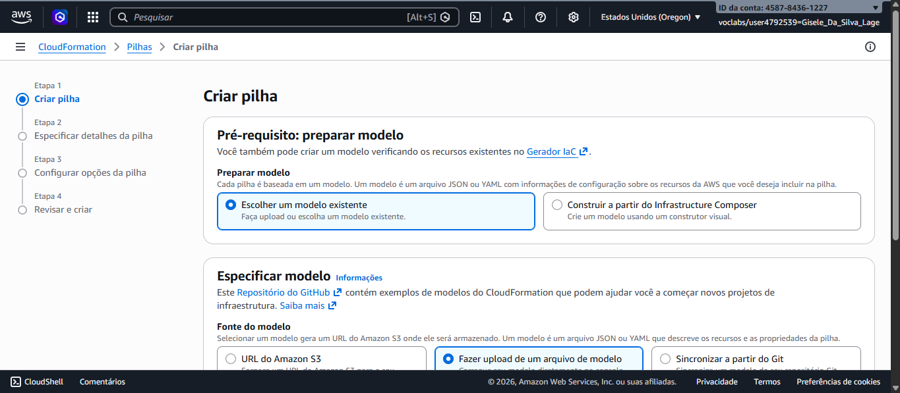

---

## 2️⃣ Upload do template de infraestrutura

Em seguida, foi realizado o upload do arquivo YAML contendo toda a definição da infraestrutura.

Esse template descreve declarativamente os recursos que a AWS deve criar.

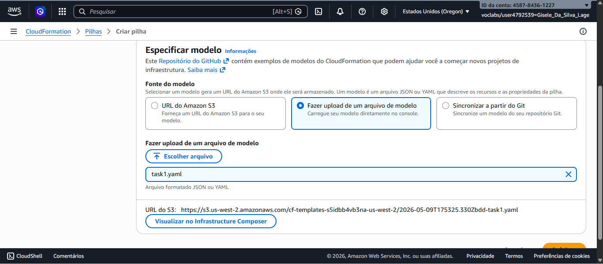

---

## 3️⃣ Definição dos parâmetros da implantação

Durante a configuração da stack, foram definidos os detalhes da implantação, como o nome da stack e os parâmetros de rede.

Neste laboratório, os blocos CIDR já estavam previamente configurados no template, permitindo reutilização padronizada da infraestrutura.

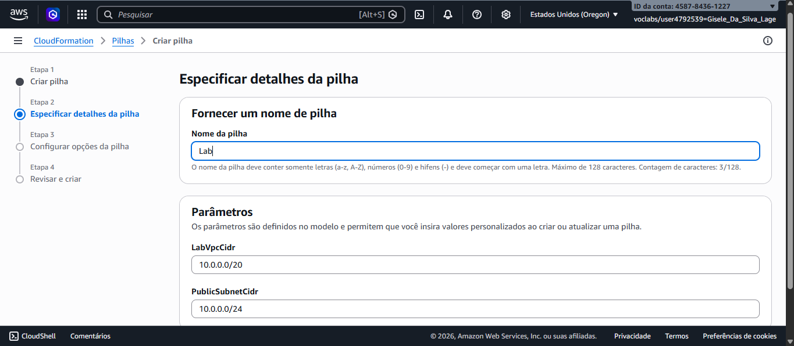

---

## 4️⃣ Início do provisionamento

Após a confirmação, a stack entrou em estado de criação.

Nesse momento, o CloudFormation começou a interpretar o template e provisionar automaticamente os recursos na ordem correta.


---

## 5️⃣ Acompanhamento dos eventos

A aba **Events** permitiu acompanhar em tempo real cada ação executada pelo CloudFormation.

Essa visualização é importante para:

- monitorar progresso;
- identificar dependências entre recursos;
- diagnosticar falhas caso ocorram.

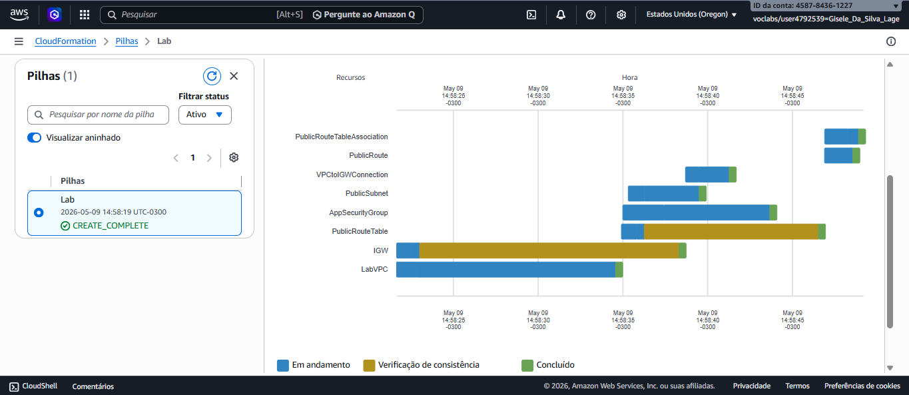

---

## 6️⃣ Criação ordenada dos recursos

Na aba **Resources**, foi possível observar que os recursos foram criados respeitando suas dependências.

Por exemplo:

- a VPC foi criada antes da subnet;
- o Internet Gateway foi criado antes da associação com a VPC;
- a tabela de rotas foi configurada após a existência da rede.

Esse gerenciamento automático de dependências é uma das principais vantagens do CloudFormation.

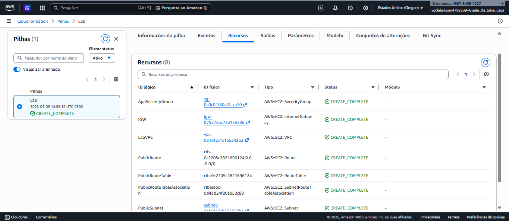

---

## 7️⃣ Finalização da implantação

Ao término do processo, a stack atingiu o status **CREATE_COMPLETE**, indicando que toda a infraestrutura foi provisionada com sucesso.

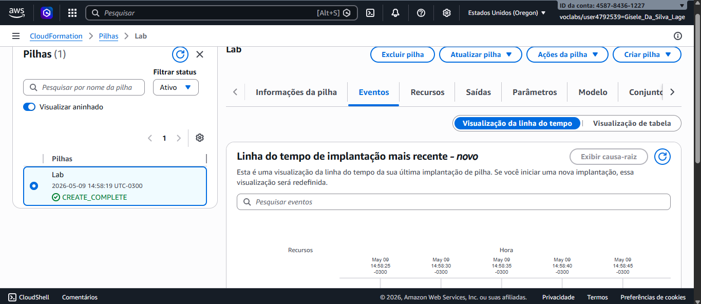

---

## 8️⃣ Validação da infraestrutura criada

Como etapa final de validação, foi acessado o console do serviço **VPC**, onde foi possível confirmar a criação da rede `LabVPC`.

Essa verificação garante que o template foi executado corretamente e que os recursos estão disponíveis para uso.

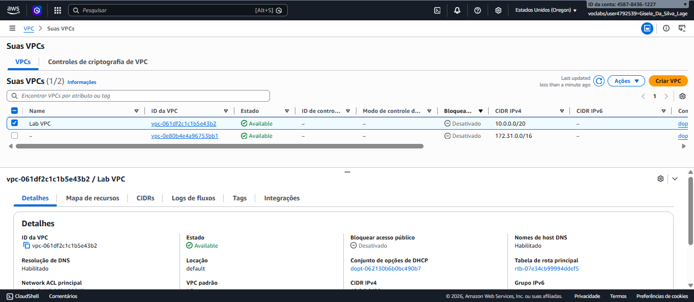

---

## ✅ Resultado da Etapa 1

Ao final desta etapa, a infraestrutura base de rede foi criada com sucesso utilizando **Infrastructure as Code (IaC)**.

Principais entregas:

- ambiente de rede padronizado;
- criação automatizada;
- recursos organizados em stack;
- base pronta para as próximas etapas do laboratório.

# 🚀 Implementação Prática — Etapa 2: Atualização da Stack com novo recurso (Desafio)

Nesta etapa foi proposto um desafio: **modificar o template existente** para adicionar um novo recurso à infraestrutura já criada, sem recriar a stack do zero.

O objetivo foi aplicar um dos principais benefícios do **AWS CloudFormation**: a capacidade de **evoluir uma infraestrutura existente por meio de atualizações controladas**.

Neste caso, foi adicionado um bucket do **Amazon S3** à stack já existente.

---

## 🎯 Objetivo da atualização

Adicionar um novo recurso de armazenamento à infraestrutura provisionada anteriormente:

- :contentReference[oaicite:0]{index=0} Bucket

Essa alteração foi feita diretamente no template YAML e aplicada utilizando o recurso de **Update Stack**.

---

## ✏️ Alteração realizada no template

O arquivo YAML original foi editado na seção `Resources`, adicionando o seguinte bloco:

```yaml
  S3Bucket:
    Type: AWS::S3::Bucket
```

Essa definição instrui o CloudFormation a criar um bucket do S3 utilizando a configuração padrão da AWS.

> Como nenhum nome foi definido explicitamente, a AWS gerou automaticamente um nome único para o bucket.

---

## 1️⃣ Início da atualização da stack

Ao invés de criar uma nova stack, foi utilizada a funcionalidade de **atualização da stack existente**, preservando todos os recursos já provisionados.

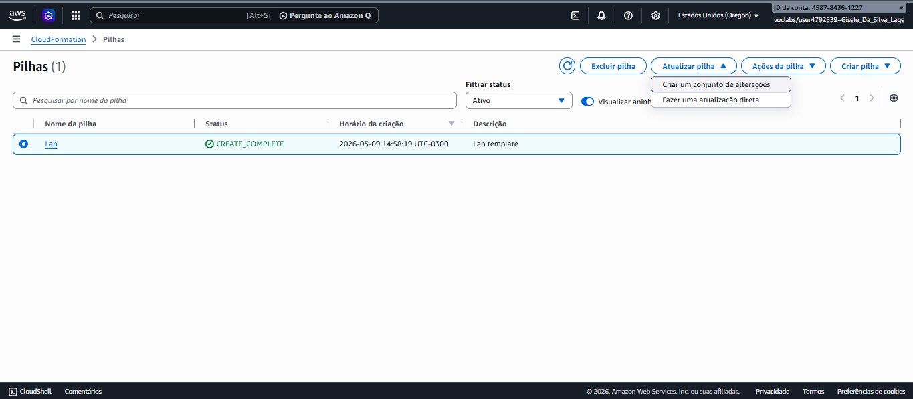

---

## 2️⃣ Upload do template atualizado

Após editar o arquivo YAML, o novo template foi carregado no CloudFormation para substituir a versão anterior.

Esse processo permite versionar e evoluir a infraestrutura de forma controlada.

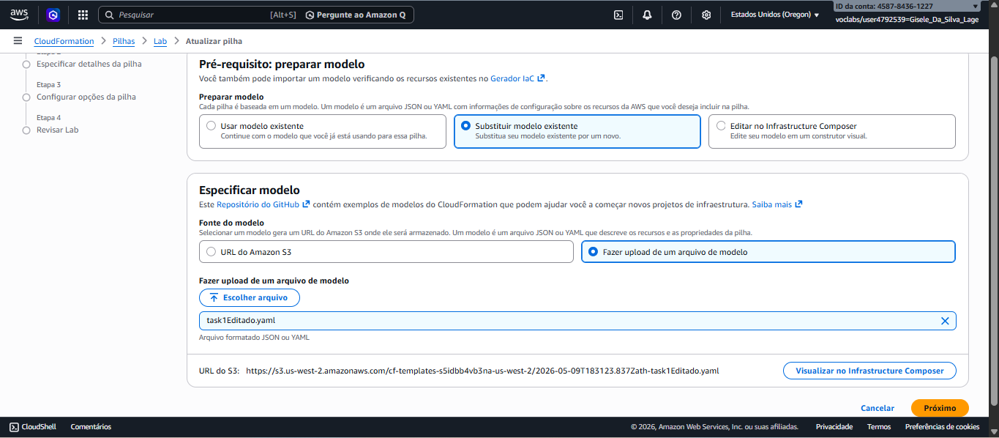

---

## 3️⃣ Revisão das mudanças detectadas

Antes de aplicar a atualização, o CloudFormation apresentou uma prévia das alterações que seriam executadas.

Nesse momento foi possível validar que **apenas um novo recurso seria adicionado**, sem impacto nos recursos já existentes.

Essa análise reduz riscos em ambientes reais de produção.

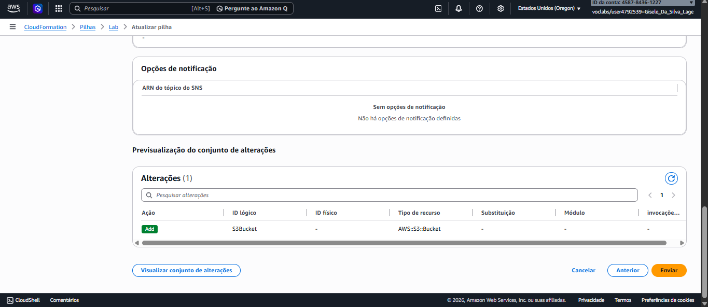

---

## 4️⃣ Aplicação da atualização

Após a confirmação, o CloudFormation executou a atualização da stack.

Diferente da criação inicial, apenas o novo recurso foi provisionado.

Esse comportamento demonstra um conceito importante:

> o CloudFormation aplica **mudanças incrementais**, sem recriar toda a infraestrutura.

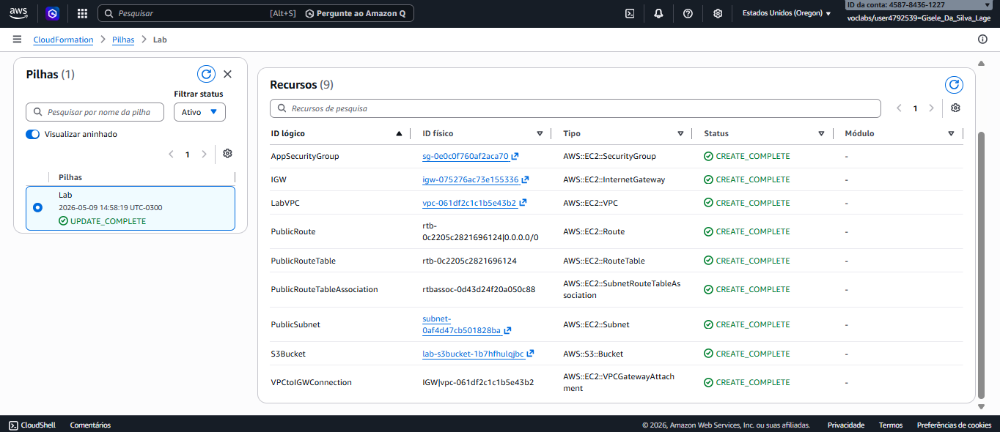

---

## 5️⃣ Validação no console do Amazon S3

Como etapa final, foi acessado o console do **Amazon S3** para confirmar a criação do bucket.

A presença do bucket validou que a atualização da stack foi concluída com sucesso.

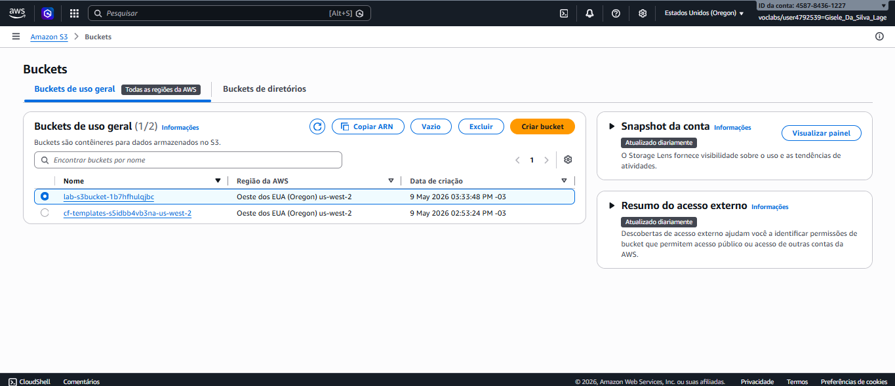

---

## ✅ Resultado da Etapa 2

Ao final desta etapa, a stack foi atualizada com sucesso, incorporando um novo recurso sem impacto nos componentes já existentes.

Principais aprendizados:

- edição de templates YAML;
- atualização incremental de stacks;
- gerenciamento de mudanças em infraestrutura;
- reaproveitamento de código IaC;
- validação de mudanças antes da execução.

---

## 💡 Insight técnico

Essa etapa demonstra uma vantagem estratégica do **Infrastructure as Code (IaC)**:

em vez de alterar recursos manualmente no console, toda mudança é feita no **template fonte**, garantindo:

- rastreabilidade;
- versionamento;
- padronização;
- facilidade de rollback.

Isso aproxima o gerenciamento de infraestrutura das práticas modernas de **DevOps**.

# 🚀 Implementação Prática — Etapa 3: Atualização da Stack com instância Amazon EC2

Na etapa final do laboratório, a infraestrutura foi expandida novamente por meio de uma **atualização incremental da stack**, adicionando agora um recurso computacional: uma instância do **Amazon EC2**.

Diferente da etapa anterior, esta atualização exigiu a integração com recursos já existentes da infraestrutura, como:

- subnet pública;
- security group;
- parâmetros dinâmicos da AWS.

Essa abordagem demonstra como o **CloudFormation permite evoluir ambientes complexos de forma modular e reutilizável**.

---

# 🎯 Objetivo da atualização

Adicionar uma instância do :contentReference[oaicite:0]{index=0} à stack existente para representar um **servidor de aplicação** dentro da VPC criada anteriormente.

---

# ✏️ Alteração 1 — Novo parâmetro dinâmico

Antes de criar a instância, foi adicionado um novo parâmetro ao template:

```yaml
AmazonLinuxAMIID:
  Type: AWS::SSM::Parameter::Value<AWS::EC2::Image::Id>
  Default: /aws/service/ami-amazon-linux-latest/amzn2-ami-hvm-x86_64-gp2
```

## 📖 Explicação

Esse parâmetro utiliza o :contentReference[oaicite:1]{index=1} para buscar automaticamente o ID da AMI mais recente do **Amazon Linux 2**.

### Vantagens dessa abordagem:

- evita informar AMI manualmente;
- funciona em diferentes regiões AWS;
- reduz risco de usar imagens desatualizadas;
- melhora portabilidade do template.

> Em ambientes reais, isso é uma boa prática de automação e manutenção.

---

# ✏️ Alteração 2 — Novo recurso EC2

Após definir o parâmetro, foi adicionado o novo recurso:

```yaml
###########
# EC2 Instance
###########

AppServer:
  Type: AWS::EC2::Instance
  Properties:
    ImageId: !Ref AmazonLinuxAMIID
    InstanceType: t3.micro
    SecurityGroupIds:
      - !Ref AppSecurityGroup
    SubnetId: !Ref PublicSubnet
    Tags:
      - Key: Name
        Value: App Server
```

---

## 📖 Explicação de cada linha

### `AppServer:`
Identificador lógico do recurso dentro do template.

É o nome usado pelo CloudFormation para controlar esse recurso.

---

### `Type: AWS::EC2::Instance`

Define que o recurso criado será uma instância do :contentReference[oaicite:2]{index=2}.

---

### `ImageId: !Ref AmazonLinuxAMIID`

Utiliza `!Ref` para buscar o valor do parâmetro criado anteriormente.

Resultado:
→ a instância será criada usando a **AMI mais recente do Amazon Linux 2**.

---

### `InstanceType: t3.micro`

Define o tipo da máquina virtual.

Características:
- baixo custo;
- ideal para laboratórios;
- elegível para free tier em muitos cenários.

---

### `SecurityGroupIds`

```yaml
- !Ref AppSecurityGroup
```

Associa a instância ao **Security Group** criado anteriormente.

Resultado:
→ a instância herda as regras de firewall já definidas.

Neste laboratório:
- acesso HTTP liberado na porta 80.

---

### `SubnetId: !Ref PublicSubnet`

Posiciona a instância dentro da **subnet pública** criada anteriormente.

Resultado:
→ a máquina passa a existir dentro da rede da VPC.

---

### `Tags`

```yaml
Key: Name
Value: App Server
```

Define o nome visível da instância no console AWS.

Isso facilita identificação e governança.

---

# 🔄 Atualização da stack

Após editar o template, foi utilizada novamente a funcionalidade de **Update Stack** no CloudFormation.

Dessa vez, o objetivo foi aplicar apenas a nova alteração, preservando todos os recursos criados anteriormente.

Essa abordagem reforça um conceito importante:

> infraestrutura não precisa ser recriada; ela pode ser **evoluída continuamente por código**.

---

## 1️⃣ Upload do novo template

O arquivo YAML atualizado foi carregado no CloudFormation para substituir a versão anterior.

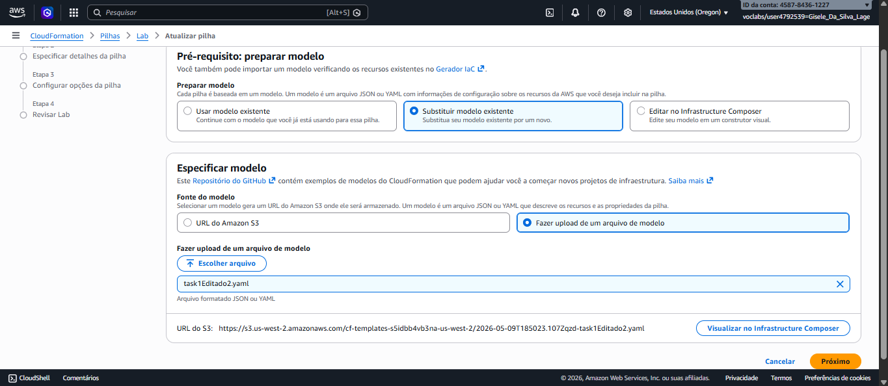

---

## 2️⃣ Validação da mudança detectada

Antes da execução, o CloudFormation identificou que o novo recurso a ser adicionado era uma instância EC2.

Isso confirma a capacidade da ferramenta de comparar versões do template.

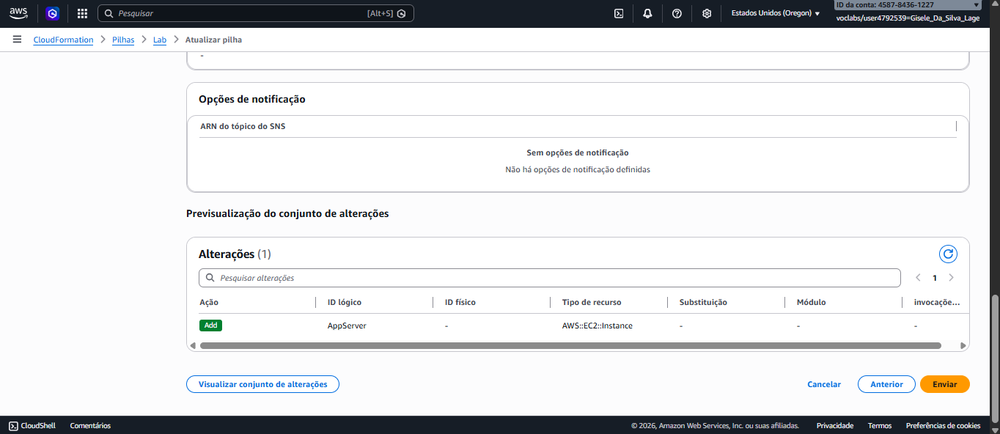

---

## 3️⃣ Recurso adicionado à stack

Após a atualização, o novo recurso passou a aparecer na aba **Resources** da stack.

Isso confirma que a alteração foi aplicada com sucesso.

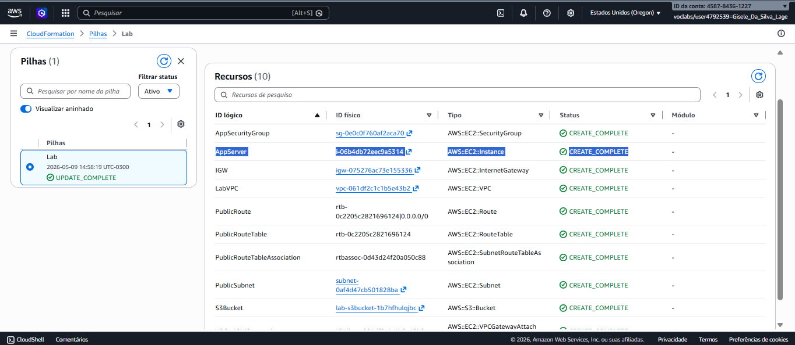

---

## 4️⃣ Validação no console EC2

Por fim, foi acessado o console do :contentReference[oaicite:3]{index=3} para validar a criação da instância **App Server**.

A presença da instância confirmou o sucesso do provisionamento.

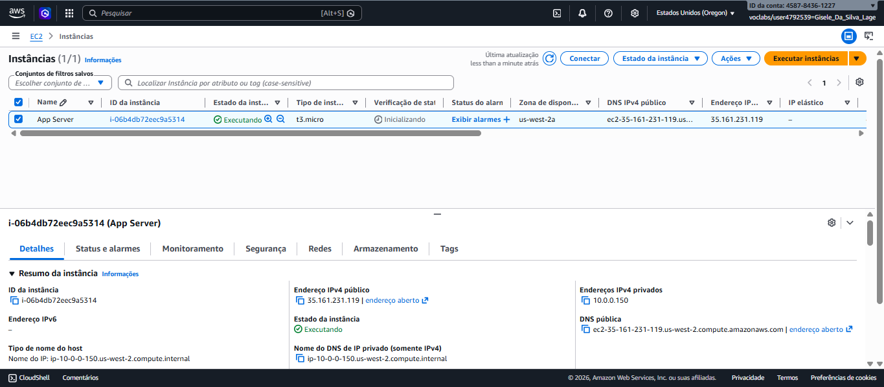

---

# ✅ Resultado da Etapa 3

Ao final desta etapa, a stack passou a conter:

- infraestrutura de rede (VPC);
- armazenamento (S3);
- computação (EC2).

Isso representa uma arquitetura cloud mais completa e próxima de um cenário real.

---

# 💡 Insight técnico

Esta etapa mostrou um dos maiores benefícios do **Infrastructure as Code**:

à medida que novas necessidades surgem, a infraestrutura pode ser expandida por meio de **mudanças controladas no template**, mantendo:

- rastreabilidade;
- versionamento;
- padronização;
- facilidade de auditoria.

---

## 📝 Conclusão

Este laboratório permitiu aplicar, de forma prática, conceitos fundamentais de **Infrastructure as Code (IaC)** utilizando o **AWS CloudFormation** para criar, atualizar e gerenciar recursos em nuvem de forma automatizada.

Ao longo das etapas, foi possível evoluir uma mesma stack progressivamente, adicionando novos componentes sem recriar a infraestrutura existente, demonstrando um dos principais benefícios do modelo declarativo em cloud.

### Principais aprendizados

- **Infraestrutura como Código (IaC)**  
  Definição de ambientes por meio de templates versionáveis, reutilizáveis e auditáveis.

- **Provisionamento automatizado**  
  Criação de recursos sem intervenção manual, reduzindo erros operacionais.

- **Atualização incremental de infraestrutura**  
  Capacidade de expandir ambientes existentes adicionando novos recursos de forma controlada.

- **Gerenciamento de dependências**  
  Uso de referências entre recursos (`!Ref`) para integração entre rede, segurança e computação.

- **Escalabilidade e governança**  
  Padronização de ambientes, rastreabilidade de mudanças e maior controle operacional.

---

✅ **Resumo final:**  
O **AWS CloudFormation** demonstrou ser uma ferramenta essencial para automação e gerenciamento de infraestrutura em nuvem, permitindo construir ambientes **padronizados, escaláveis e reproduzíveis**, seguindo práticas modernas de **Cloud Engineering** e **DevOps**.


