# 🚀 Escalabilidade e Alta Disponibilidade na AWS: Implementando Auto Scaling e Load Balancing (Linux e AWS CLI)

---

## 💼 Cenário de Negócio

Este projeto simula a necessidade de uma aplicação web que enfrenta variações constantes de tráfego. O desafio era garantir que a aplicação fosse **resiliente** (capaz de se recuperar de falhas) e **elástica** (capaz de aumentar ou diminuir recursos conforme a demanda), otimizando custos e mantendo a performance para o usuário final.

A arquitetura foi desenhada seguindo o padrão **Multi-AZ**, distribuindo servidores em diferentes Zonas de Disponibilidade para garantir a continuidade do negócio mesmo em caso de falha em um Data Center inteiro.

---

## 🎯 Objetivo do Projeto

Configurar uma infraestrutura auto-gerenciável na AWS, utilizando uma abordagem híbrida: **AWS CLI** para o provisionamento técnico de base e o **Console de Gerenciamento** para a orquestração de serviços de escalonamento dinâmico.

---

## 🏗️ Estrutura da Infraestrutura

| Componente | Especificação | Finalidade |
| :--- | :--- | :--- |
| **Região** | us-west-2 (Oregon) | Localização dos recursos físicos. |
| **Rede (VPC)** | Lab VPC | Isolamento lógico do ambiente. |
| **Sub-redes** | Privadas (AZ1 e AZ2) | Hospedagem segura das instâncias de aplicação. |
| **Capacidade** | Mín 2 / Máx 4 | Balanço entre disponibilidade e custo. |
| **Política de Scaling** | Target Tracking (50% CPU) | Manter a performance estável sob carga. |

---

## ⚙️ Implementação Prática: Tarefa 1 (Provisionamento CLI)

### 1. Preparação do Ambiente: O Command Host
Para iniciar o projeto, utilizamos uma instância chamada **Command Host**.

* **O que é:** Um servidor administrativo (*Bastion Host*) configurado para ser o ponto central de controle dentro da nuvem.
* **Função e Cenário:** Em um cenário real, o acesso seria feito via SSH diretamente do computador pessoal. No ambiente de laboratório, usamos o Command Host para garantir que todas as ferramentas (AWS CLI) e permissões de rede já estejam configuradas corretamente no Linux do laboratório.
* **Conexão:** O acesso foi realizado via terminal Linux. Como o sistema operacional do servidor base também é Linux, utilizamos comandos Bash para toda a manipulação do sistema.

### 2. Autenticação e Configuração
Antes de enviar comandos para a AWS, precisei configurar as credenciais de acesso.

* **Comando:** `aws configure` (ou exportação de variáveis).
* **Função:** Informar as chaves de acesso (`Access Key` e `Secret Key`) para que o CLI tenha permissão de criar recursos na conta.
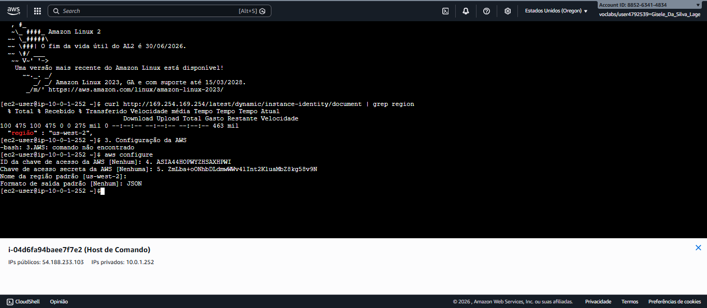

#### Validação de Região
`curl http://169.254.169.254/latest/dynamic/instance-identity/document | grep region`
* **Função:** Comando Linux que consulta o serviço de metadados da instância para confirmar em qual região geográfica os recursos estão sendo criados.

### 3. Automação via User Data
Naveguei até a pasta de scripts para validar a automação:
`cd /home/ec2-user/`
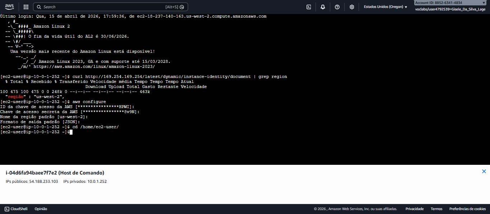

Para inspecionar o script de instalação, usei:
`more UserData.txt`
* **Função:** O comando `more` exibe o conteúdo de arquivos de texto. Validamos aqui o script que instala automaticamente o Apache e PHP no servidor.
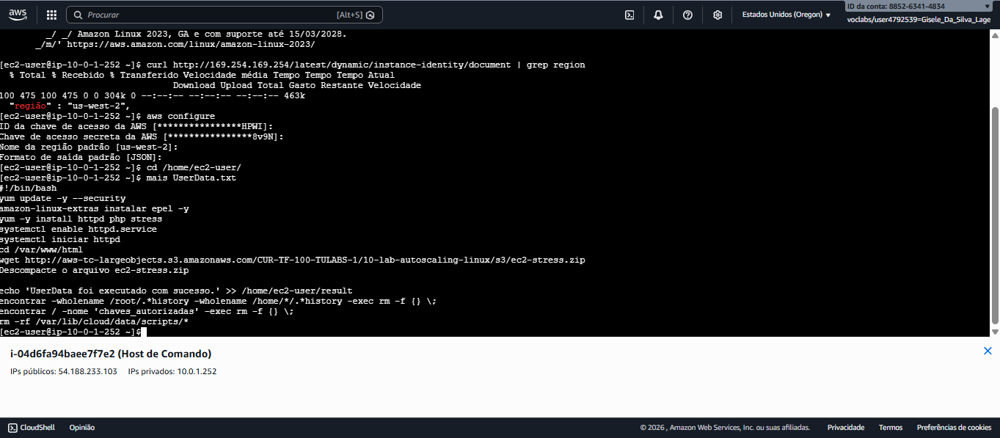

### 4. Lançamento da Instância Base
Após ajustar as credenciais de sessão, lancei o servidor que servirá de modelo:
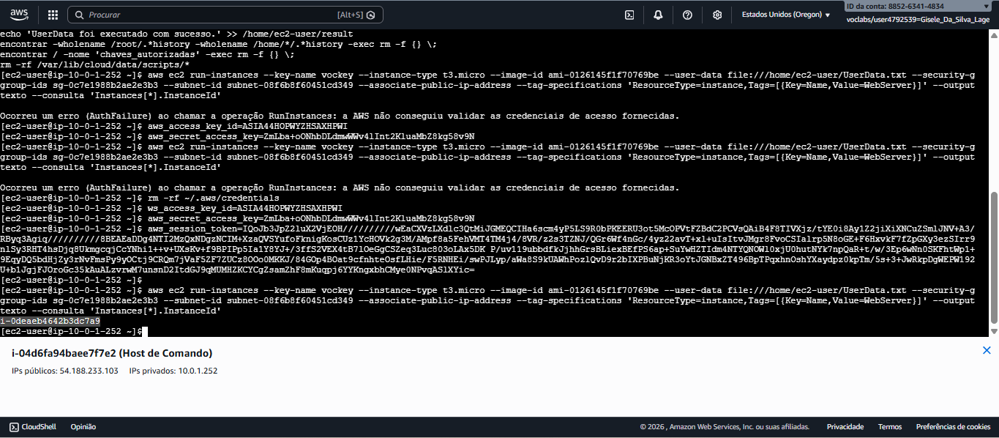

> **Comando de Provisionamento:**
> ```bash
> aws ec2 run-instances --key-name vockey --instance-type t3.micro --image-id ami-0126145f1f70769be --user-data file:///home/ec2-user/UserData.txt --security-group-ids sg-0c7e1988b2ae2e3b3 --subnet-id subnet-08f6b8f60451cd349 --associate-public-ip-address --tag-specifications 'ResourceType=instance,Tags=[{Key=Name,Value=WebServer}]' --output text --query 'Instances[*].InstanceId'
> ```
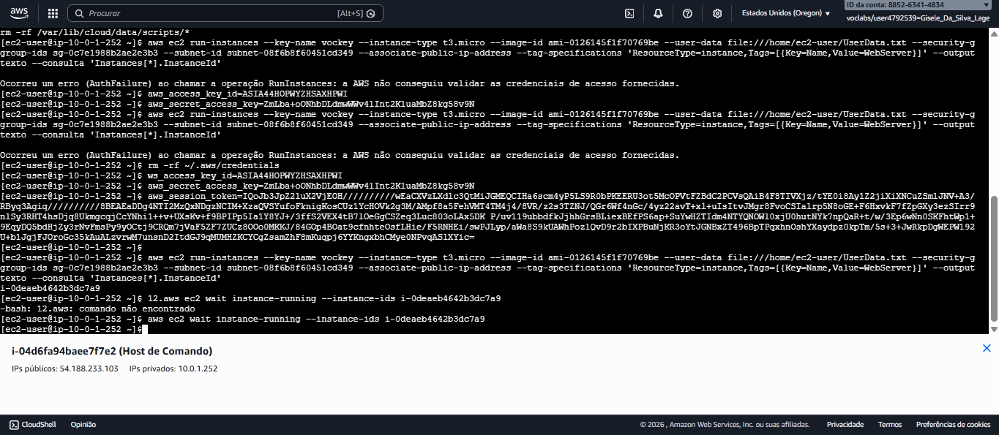

#### Sincronização de Estado
`aws ec2 wait instance-running --instance-ids [ID]`
* **Função:** Comando que pausa o terminal até que a instância esteja totalmente "Ligada" (Running).

### 5. Validação e Golden Image
Para testar o servidor, capturei seu DNS Público:
`aws ec2 describe-instances --instance-id [ID] --query 'Reservations[0].Instances[0].NetworkInterfaces[0].Association.PublicDnsName' --output text`
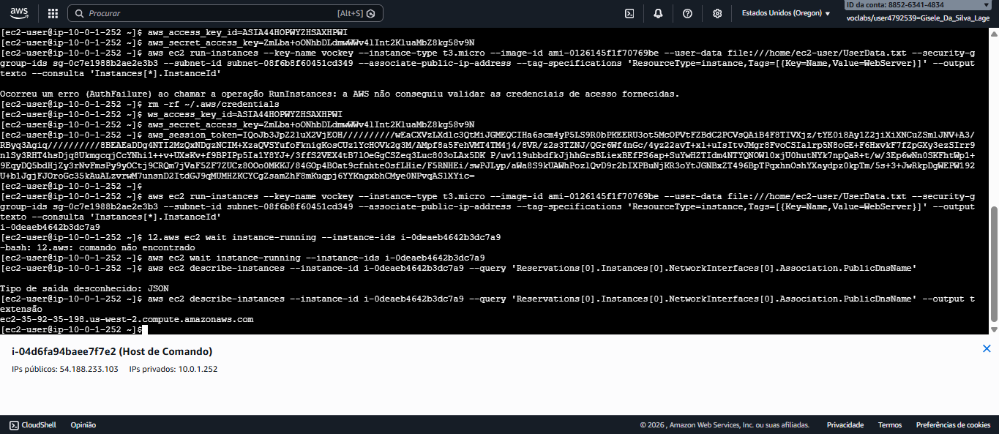

Ao acessar o endereço no navegador, confirmei que o servidor base estava operando corretamente:

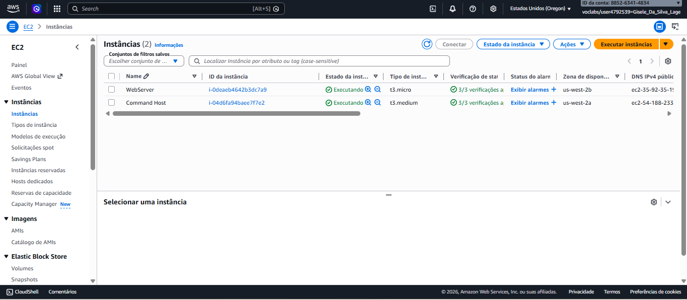

#### Criando o Molde (AMI)
`aws ec2 create-image --name WebServerAMI --instance-id [ID]`
* **Função:** Este comando cria a **Golden Image**. Ela "congela" o estado atual do servidor para que o Auto Scaling possa criar clones idênticos posteriormente.
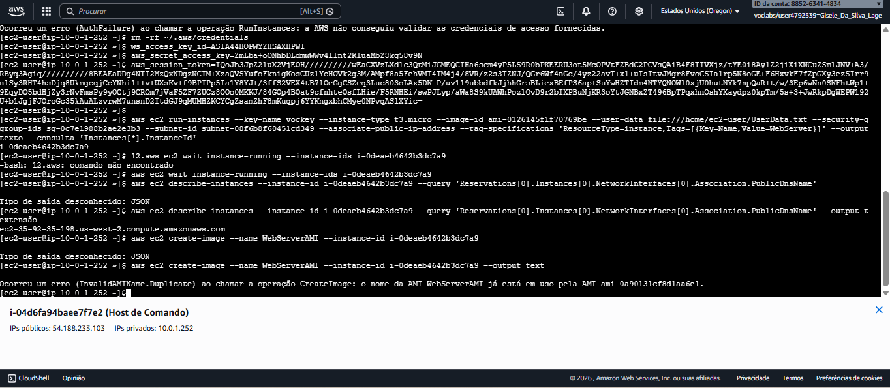
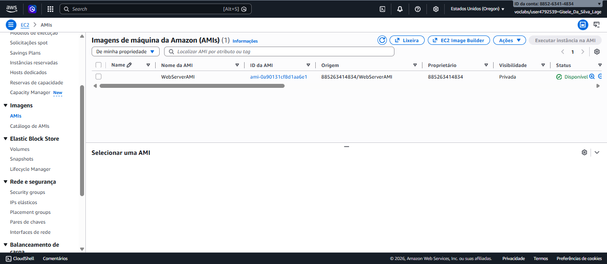

---

## ⚙️ Orquestração de Alta Disponibilidade (Console Management)

Nesta etapa, utilizamos o **Console de Gerenciamento da AWS** para orquestrar os serviços. 

> **Nota sobre IaC:** Em ambientes profissionais, o uso de ferramentas de **Infraestrutura como Código (IaC)**, como **Terraform** ou **CloudFormation**, é o padrão para garantir reprodutibilidade. Neste projeto, utilizamos o Console para obter uma visão visual clara de como os componentes se conectam antes de avançarmos para a automação total.

### 1. Application Load Balancer (ALB)
O ALB é o ponto de entrada único para os usuários. Ele distribui o tráfego entre os servidores saudáveis.

* **Grupo de Destino (Target Group):** Define para onde o tráfego deve ser encaminhado e realiza "Health Checks" constantes.
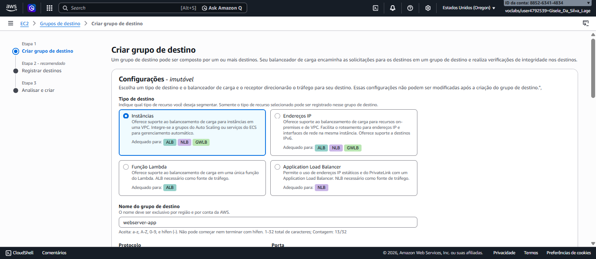
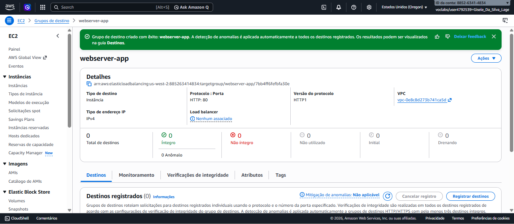

* **Criação do ALB:** Configuramos o balanceador para trabalhar em múltiplas AZs, garantindo resiliência.
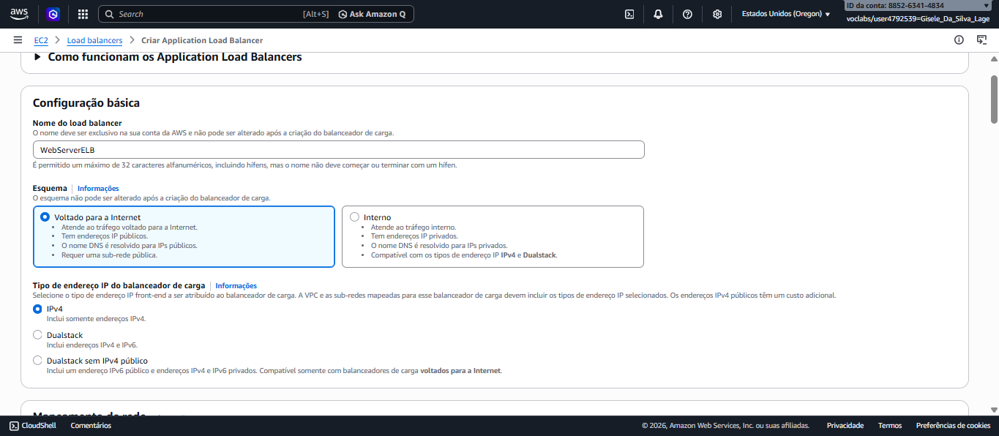
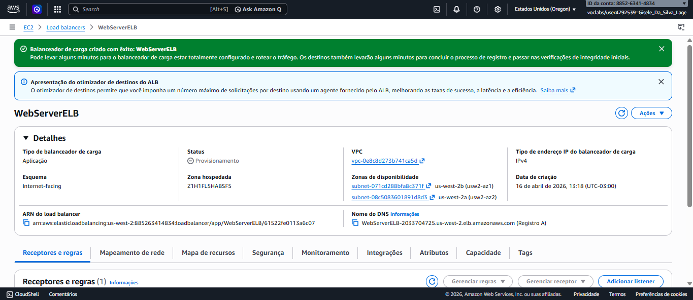

---

### 2. Modelo de Execução e Auto Scaling
O segredo da elasticidade reside na combinação do modelo de configuração com o grupo de gerenciamento.

* **Modelo de Execução (Launch Template):** É a "receita" que o Auto Scaling usa para criar novas máquinas. Ele contém o ID da AMI que criamos via CLI.
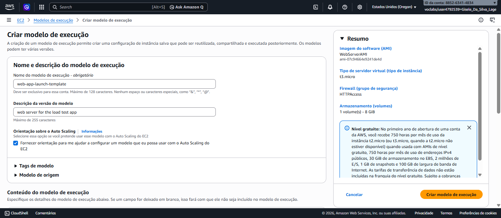

* **Auto Scaling Group (ASG):** Define as regras de crescimento (Mínimo 2 / Máximo 4). Ele monitora a saúde das instâncias e as substitui se necessário.
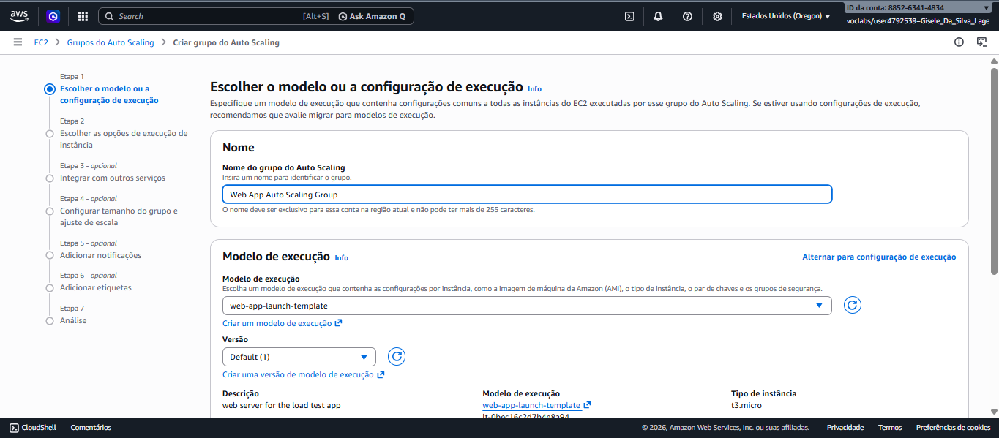
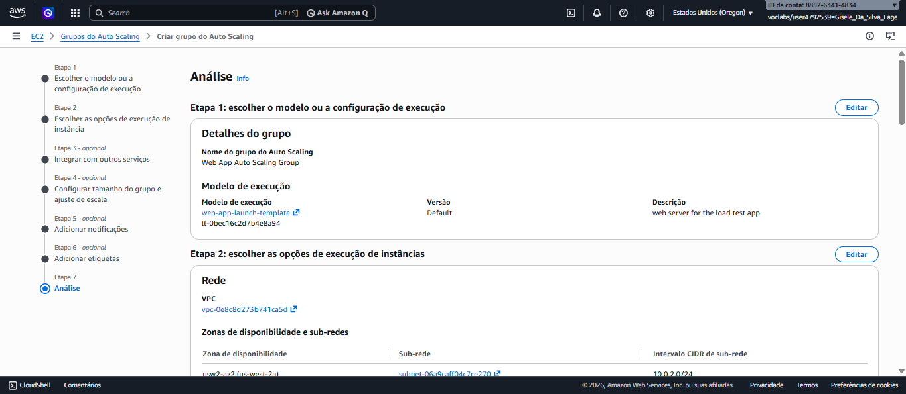
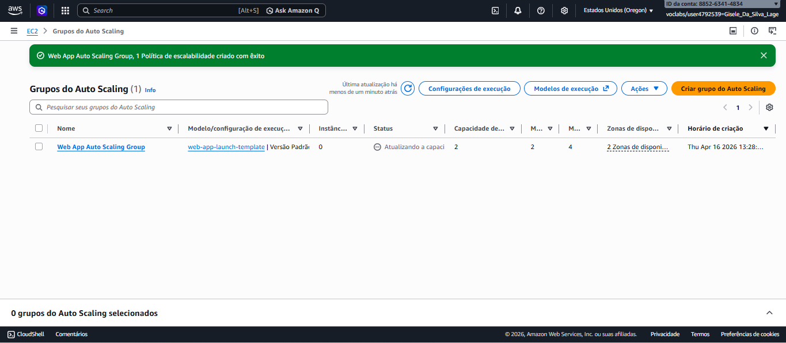

Assim que o ASG foi ativado, ele identificou a necessidade de manter o mínimo de 2 instâncias e as criou automaticamente.
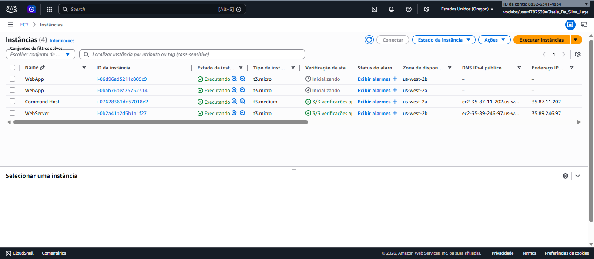

---

## ⚡ Teste de Estresse e Elasticidade

Para validar a arquitetura, utilizamos alarmes do **Amazon CloudWatch** para disparar o escalonamento automático.

### 🚩 Alarme do CloudWatch
Os alarmes monitoram a métrica de CPU. Quando o estresse ultrapassa 50%, o alarme é disparado.
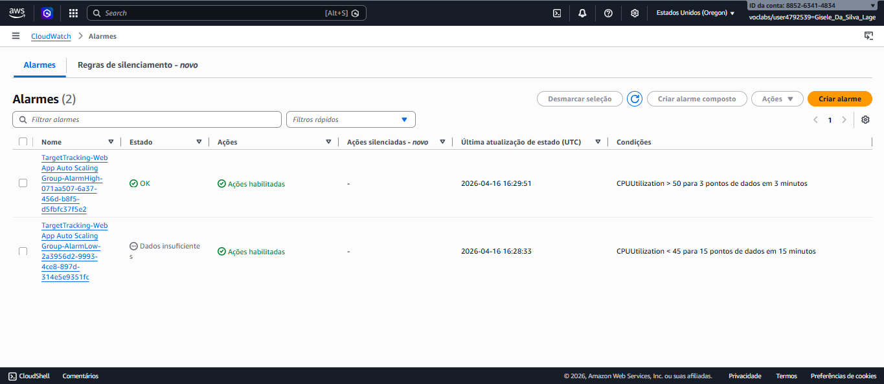
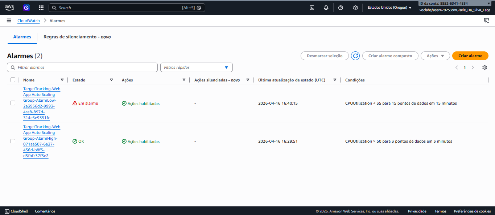

### 🚀 Resultado: Scaling Out
Após o disparo do alarme, o Auto Scaling iniciou o provisionamento de novas instâncias para dividir a carga. Embora a visualização final do limite máximo de instâncias tenha sofrido delays de propagação do laboratório, o histórico de atividades confirmou o lançamento bem-sucedido de novas instâncias `WebApp` em resposta ao estresse.

---

## 📝 Conclusão

Este projeto consolidou conhecimentos fundamentais para a certificação **Cloud Practitioner**. 

### Principais aprendizados:
- **Resiliência:** Uso de Multi-AZ para evitar quedas.
- **Elasticidade:** Auto Scaling economiza custos e mantém a performance.
- **Automação Híbrida:** Eficiência ao unir CLI (base) com Console (orquestração).

✅ **Status do Projeto:** Implementado com sucesso e validado.
