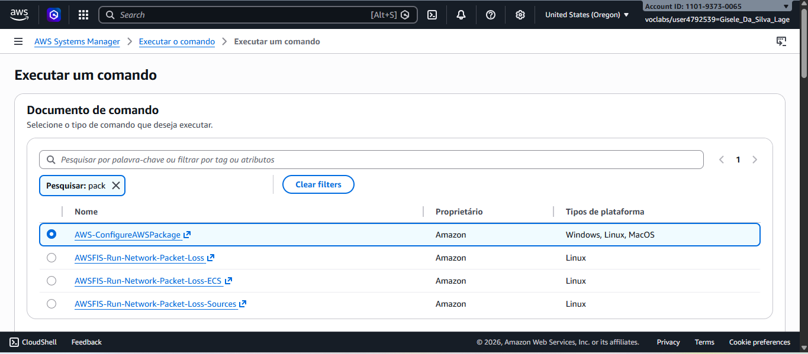
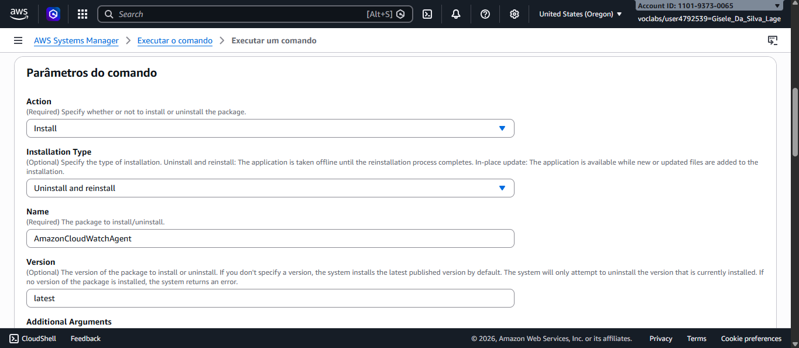
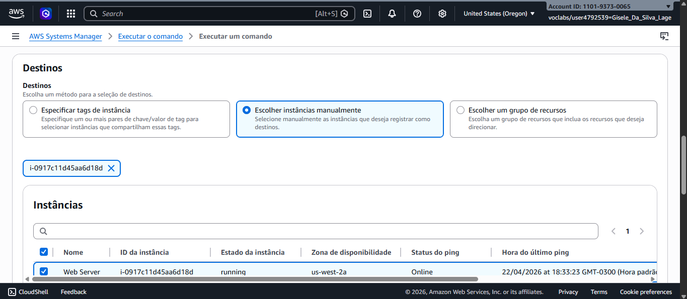
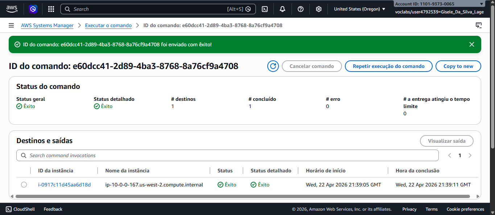
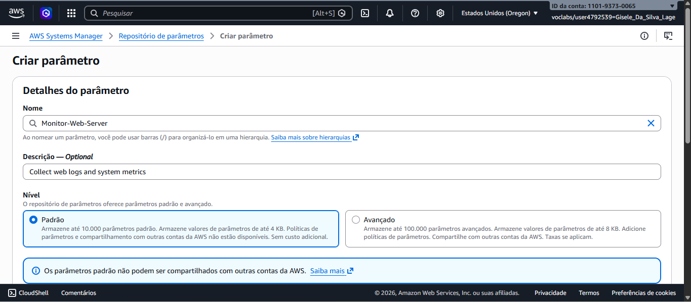
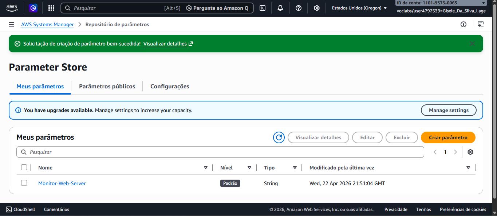
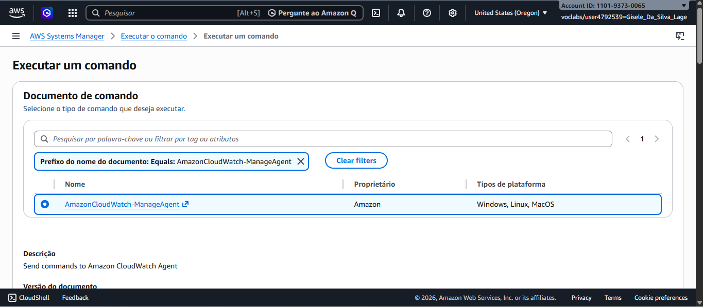
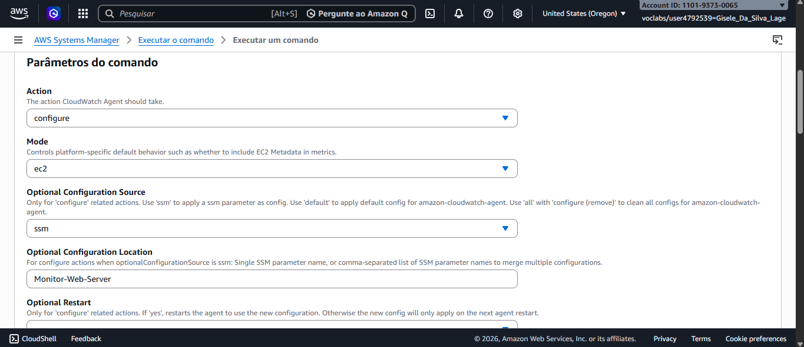
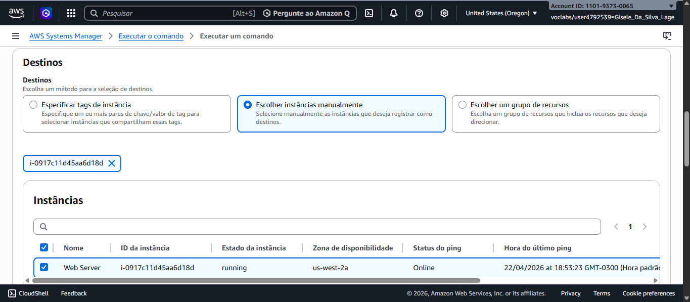
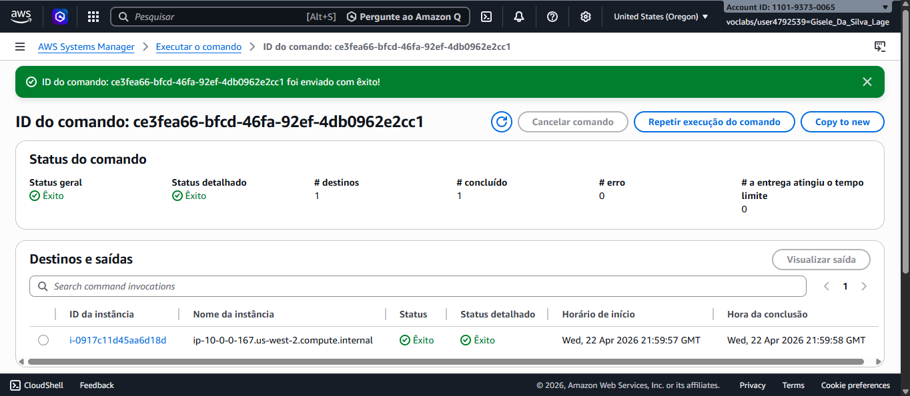

# 📊 Monitoramento de Servidor Web com CloudWatch Agent

---

## 💼 Cenário de Negócio

Este projeto simula um cenário fictício em que uma empresa precisa monitorar métricas de sistema e logs de um servidor web hospedado em uma instância EC2.  
A solução utiliza o **Amazon CloudWatch Agent** em conjunto com o **AWS Systems Manager** para instalar, configurar e iniciar o agente de forma automatizada.

---

## 🎯 Objetivo do Projeto

Instalar e configurar o **CloudWatch Agent** em uma instância EC2, garantindo que métricas de CPU, memória, disco e logs do servidor web sejam coletados e enviados ao **Amazon CloudWatch**.

---

## ⚙️ Atividades Realizadas

- Instalação do CloudWatch Agent via documento **AWS-ConfigureAWSPackage**  
- Criação de configuração personalizada no **Parameter Store** (`Monitor-Web-Server`)  
- Execução do documento **AmazonCloudWatch-ManageAgent** para iniciar o agente com a configuração definida  
- Validação da execução dos comandos no **Systems Manager**  
- Visualização dos dados enviados ao **CloudWatch**  

---

## 🛠️ Tecnologias Utilizadas

- **AWS Systems Manager** (Run Command, Parameter Store)  
- **Amazon CloudWatch** (Logs e Metrics)  
- **Amazon EC2** (instância Linux com servidor web)  

---

## 📜 Etapas da Implementação

### 🔹 Instalação do CloudWatch Agent

Documento utilizado: **AWS-ConfigureAWSPackage**  
Parâmetros configurados:  
- Ação: instalar  
- Nome: AmazonCloudWatchAgent  
- Versão: latest  

**Resultado:** agente instalado com sucesso na instância alvo.  

  
  
  

---

### 🔹 Criação da Configuração no Parameter Store

Nome: `Monitor-Web-Server`  
Descrição: `Collect web logs and system metrics`  
Valor: JSON contendo instruções para coleta de logs e métricas.  

Esse parâmetro guarda instruções (em formato JSON) que dizem ao agente:  
- Quais arquivos de log devem ser enviados ao **CloudWatch Logs**.  
- Quais métricas de sistema (CPU, memória, disco, swap etc.) devem ser enviadas ao **CloudWatch Metrics**.  
- O agente, quando iniciado, vai buscar esse parâmetro no **Parameter Store** e aplicar essa configuração.  
- 👉 Esse parâmetro é o **manual de instruções** que o CloudWatch Agent vai seguir.  
- Sem ele, o agente estaria instalado mas não saberia o que coletar.  

  

---

### 🔹 Início do CloudWatch Agent

O que aconteceu até agora:  
- Com o documento **AWS-ConfigureAWSPackage**, eu apenas instalei o CloudWatch Agent na instância.  
- Nesse momento, o agente está presente no sistema, mas ainda não está rodando com nenhuma configuração.  

👉 Para ele começar a funcionar, precisa de duas coisas:  
1. Uma configuração (o JSON que salvei no Parameter Store, chamado `Monitor-Web-Server`).  
2. Um comando para iniciar o agente e dizer: “use essa configuração”. É aí que entra o documento **AmazonCloudWatch-ManageAgent**.  

Quando executar esse segundo comando com os parâmetros:  
- **Ação = configurar**  
- **Modo = ec2**  
- **Origem da configuração = ssm**  
- **Local da configuração = Monitor-Web-Server**  
- **Reinício = sim**  

O agente vai buscar o parâmetro no **Parameter Store**, aplicar as instruções e começar a coletar logs e métricas.  

  
  

---

### 🔹 CloudWatch em Execução

O agente do CloudWatch agora está em execução na instância, enviando dados de log e métricas para o **Amazon CloudWatch**.  

---

## ✅ Situação Final

- O agente está **instalado e em execução** na instância EC2.  
- Logs do servidor web e métricas de sistema estão sendo enviados ao **Amazon CloudWatch**.  

---

## 📝 Conclusão

Este laboratório demonstrou como instalar e configurar o **CloudWatch Agent** utilizando o **AWS Systems Manager**, centralizando a configuração no **Parameter Store** e garantindo automação e consistência no monitoramento de instâncias EC2.  

