# 🔐 Gerenciamento de Acessos na AWS com IAM

---

## 💼 Cenário de Negócio

Este projeto simula um cenário fictício de uma empresa que precisa estruturar o controle de acesso aos seus recursos em nuvem utilizando o AWS Identity and Access Management (IAM).

A abordagem adotada consiste na organização de permissões por meio de grupos de usuários, onde cada grupo representa um conjunto de acessos específicos a serviços como Amazon EC2 e Amazon S3.

Essa estratégia facilita a gestão de acessos e segue boas práticas de segurança, como o princípio do menor privilégio.

---

### 🔑 Estrutura de Acessos

| Usuário  | Grupo        | Tipo de Acesso |
|----------|-------------|----------------|
| user-1   | S3 Support  | Leitura no Amazon S3 |
| user-2   | EC2 Support | Leitura no Amazon EC2 |
| user-3   | EC2 Admin   | Visualizar, iniciar e parar instâncias EC2 |

> A partir dessa definição, as permissões são implementadas e validadas ao longo do laboratório.

---

## 🎯 Objetivo do Projeto

Implementar e testar um sistema de gerenciamento de identidades e acessos na AWS utilizando o IAM, garantindo segurança e controle sobre os recursos da conta.

---

## ⚙️ Atividades Realizadas

- Configuração de política de senha  
- Análise de usuários e grupos pré-existentes  
- Inspeção de permissões via políticas IAM  
- Associação de usuários a grupos  
- Teste prático das restrições de acesso  
- Utilização do URL de login do IAM  

---

## 🛠️ Tecnologias Utilizadas

- AWS IAM (Identity and Access Management)  
- Gerenciamento de usuários e grupos  
- Políticas de permissão (IAM Policies)  
- Princípio do menor privilégio  
- Controle de acesso em nuvem  

---

## 🏗️ Estrutura de Permissões (IAM)

Este projeto utiliza uma abordagem baseada em grupos para gerenciar permissões de acesso aos serviços da AWS.

A estrutura segue o princípio do menor privilégio, garantindo que cada usuário tenha apenas as permissões necessárias para executar suas atividades.

O modelo adotado representa a relação entre:

- Usuários  
- Grupos  
- Políticas de permissão  

> Diagrama desenvolvido utilizando draw.io (diagrams.net)

## ⚙️ Implementação Prática

### 🔐 Configuração da Política de Senha

Nesta etapa, foi realizada a configuração da política de senhas da conta no AWS Identity and Access Management (IAM), com o objetivo de reforçar a segurança no acesso aos usuários.

#### 🔧 Configuração

A política foi ajustada para atender a requisitos mais rigorosos, incluindo:

- Comprimento mínimo de **10 caracteres**  
- Obrigatoriedade de:
  - Letras maiúsculas  
  - Letras minúsculas  
  - Números  
  - Caracteres especiais  
- Expiração de senha configurada para **90 dias**  
- Prevenção de reutilização das últimas **5 senhas**  
- Permissão para que usuários alterem suas próprias senhas  

#### ✅ Resultado

Após a configuração, as alterações foram aplicadas com sucesso, passando a valer para todos os usuários da conta.

### 👥 Exploração de Usuários, Grupos e Políticas do IAM

Nesta etapa, foi realizada a análise da estrutura de usuários, grupos e permissões no AWS Identity and Access Management (IAM).

O ambiente já possuía usuários e grupos previamente configurados, conforme o padrão do laboratório, não sendo permitida a criação de novos recursos. O foco desta etapa foi compreender como o controle de acesso é estruturado.

---

## 👤 Análise dos Usuários

Foram identificados três usuários no ambiente:

- user-1  
- user-2  
- user-3  

Ao analisar o usuário **user-2**, observou-se que:

- Não possui permissões diretamente atribuídas  

- Não pertence a nenhum grupo  
- Possui credenciais de acesso ao console  

Essa configuração demonstra que, sem associação a grupos ou políticas, o usuário não possui acesso efetivo aos recursos da AWS.

> Este comportamento evidencia que, no IAM, as permissões devem ser explicitamente atribuídas, seja por meio de grupos ou políticas.

---

## 👥 Análise dos Grupos de Usuários

Foram analisados os seguintes grupos:

- EC2 Admin  
- EC2 Support  
- S3 Support  

Cada grupo possui permissões específicas associadas por meio de políticas, facilitando o gerenciamento centralizado de acessos.

---

## 📜 Análise das Políticas de Permissão

### 🔹 EC2 Support

- Política associada: **AmazonEC2ReadOnlyAccess**  
- Tipo: política gerenciada pela AWS  
- Permissões: permite visualizar recursos do EC2, sem possibilidade de modificação  

---

### 🔹 S3 Support

- Política associada: **AmazonS3ReadOnlyAccess**  
- Tipo: política gerenciada pela AWS  
- Permissões: permite listar e visualizar recursos do Amazon S3  

---

### 🔹 EC2 Admin ⭐

- Política associada: **EC2-Admin-Policy**  
- Tipo: política inline (customizada)  
- Permissões:
  - Visualizar recursos (Describe)  
  - Iniciar e parar instâncias EC2  

> Diferente das demais, esta política é do tipo inline, sendo exclusiva deste grupo e não reutilizável.

---

## 🧩 Estrutura das Políticas IAM

Durante a análise, foi possível observar que as políticas seguem uma estrutura padrão:

- **Effect**: define se a ação é permitida ou negada  
- **Action**: especifica quais ações podem ser executadas  
- **Resource**: define os recursos aos quais a regra se aplica  

### 🔗 Associação de Usuários a Grupos

Nesta etapa, foi realizada a associação dos usuários aos grupos previamente configurados no AWS Identity and Access Management (IAM), conforme a definição de acessos estabelecida no cenário de negócio.

---

## 📌 Situação Inicial

Antes da associação, os grupos não possuíam usuários vinculados:

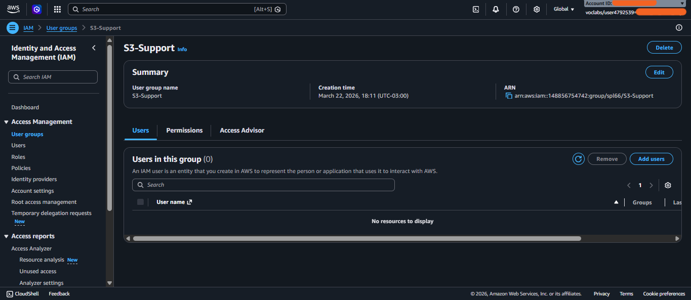

---

## ➕ Adição de Usuários aos Grupos

A associação foi realizada adicionando os usuários aos respectivos grupos, permitindo que herdassem automaticamente as permissões definidas nas políticas.

Exemplo de adição do usuário ao grupo:

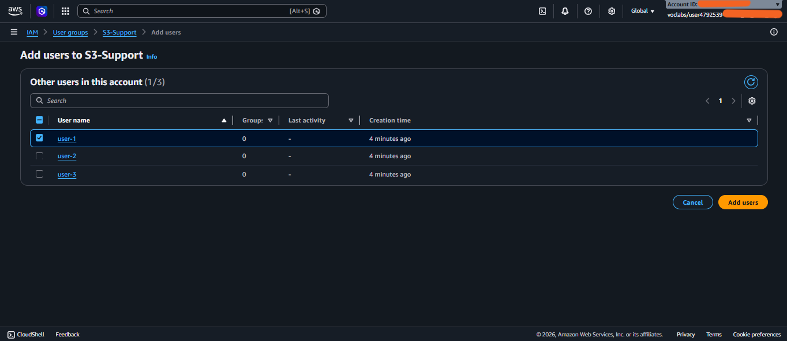

---

## ✅ Resultado da Associação

Após a configuração, os usuários passaram a fazer parte dos grupos correspondentes:

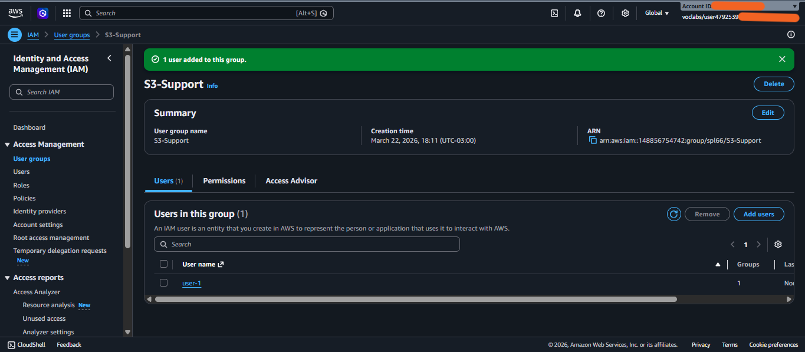

---

## 📊 Validação Final

Ao final da etapa, cada grupo possuía um usuário associado, conforme definido no cenário:

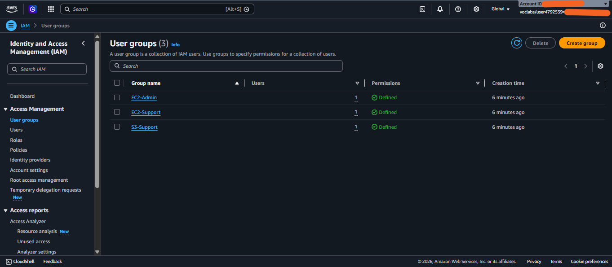

---

## 💡 Considerações

Ao serem adicionados aos grupos, os usuários passaram a herdar automaticamente as permissões associadas às políticas vinculadas a cada grupo.

Essa abordagem elimina a necessidade de atribuir permissões individualmente, tornando o gerenciamento de acesso mais escalável, organizado e alinhado às boas práticas de segurança, como o princípio do menor privilégio.

## 🔐 URL de Login do IAM

O acesso foi realizado por meio de uma **URL específica para usuários do IAM**.  
Esta URL permite que usuários criados no IAM acessem a conta sem utilizar o usuário root e com ID do root já embutido na URL, garantindo **maior segurança e controle de acesso**.

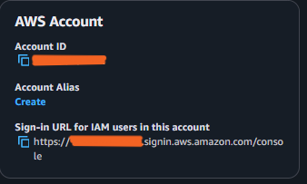

---

## 👤 Testes de Acesso por Usuário

### 🔹 user-1 (S3 Support)
- ✅ Conseguiu acessar o **Amazon S3** e visualizar buckets  
  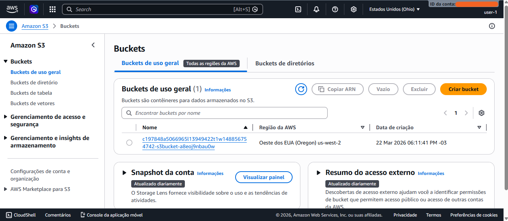
- ❌ Não conseguiu acessar o **Amazon EC2**  
  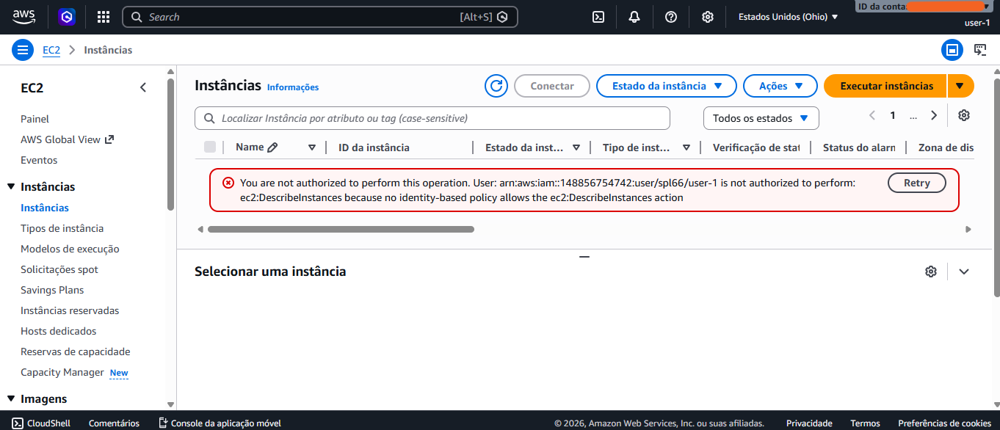

**Resultado:** acesso restrito corretamente ao serviço S3.

---

### 🔹 user-2 (EC2 Support)
- ✅ Conseguiu **visualizar instâncias do EC2**  
  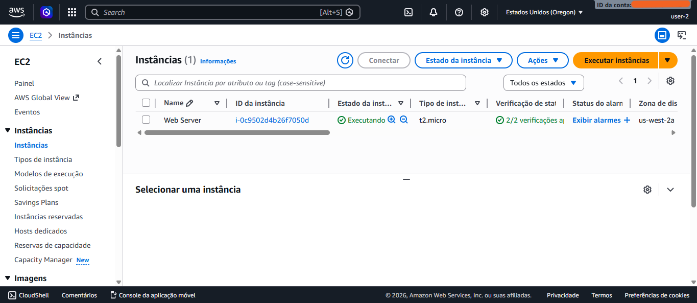
- ❌ Não conseguiu **interromper instâncias**  
  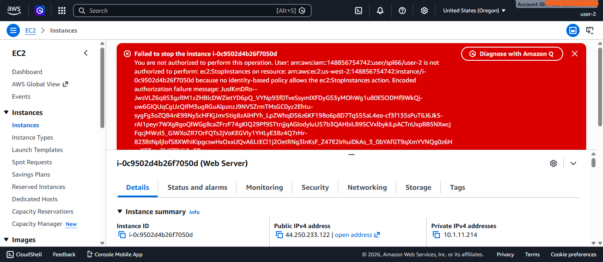
- ❌ Não conseguiu acessar o **S3**  
  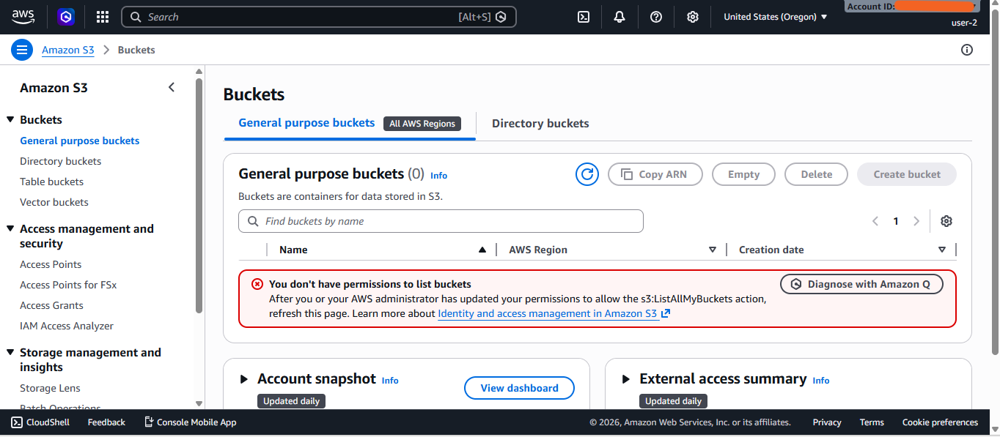

**Resultado:** acesso de leitura aplicado corretamente (sem permissões de modificação).

---

### 🔹 user-3 (EC2 Admin)
- ✅ Conseguiu **interromper instâncias EC2**  
  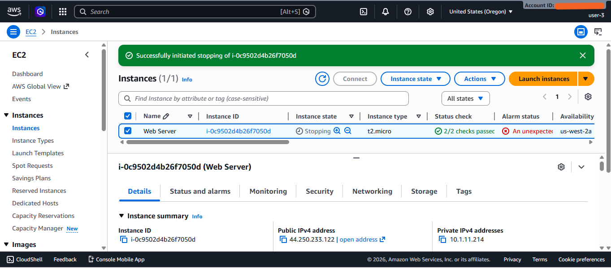

**Resultado:** usuário com permissões completas (admin) executando ações corretamente. ⭐

---

## 📌 Observações Finais
- Cada print demonstra a **aplicação correta das políticas de IAM**.  
- Prova de acesso negado e permitido é essencial para **validar a segurança e segregação de funções**.

---

## 📝 Conclusão

Este laboratório permitiu aplicar, de forma prática, conceitos essenciais de **controle de acesso em ambientes cloud** utilizando o **AWS Identity and Access Management (IAM)**.

### Principais aprendizados:

- **Gerenciamento baseado em grupos:**  
  - Abordagem eficiente e escalável para gerenciar permissões.  
  - Facilita a administração de acessos e reduz riscos de configurações incorretas.

- **Validação de acessos:**  
  - Testar permissões com diferentes usuários é fundamental.  
  - Garante que os acessos estejam alinhados com as necessidades de cada perfil.

- **Segurança na nuvem:**  
  - O laboratório reforça a importância de políticas de acesso bem definidas.  
  - Demonstra que o IAM é um **componente essencial para proteção de recursos e controle de acesso** em ambientes AWS.

✅ **Resumo final:**  
O exercício evidencia que o IAM não é apenas uma ferramenta de gestão, mas uma peça-chave para **segurança, compliance e governança** na nuvem, mostrando como aplicar práticas seguras de forma prática e escalável.
