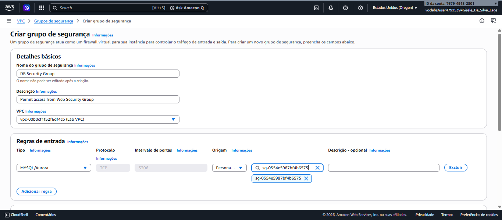
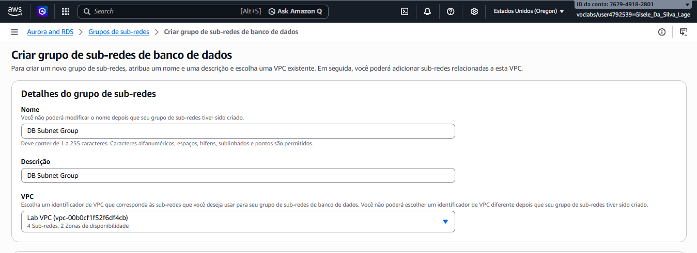

# 🗄️ Banco de Dados Relacional na AWS com RDS

---

## 💼 Cenário de Negócio

Este projeto simula um ambiente em que uma aplicação web precisa armazenar dados de forma segura e resiliente.  
Para isso, foi utilizado o **Amazon RDS** com o mecanismo **MySQL**, configurado em modo **Multi-AZ** para garantir alta disponibilidade e replicação automática entre zonas de disponibilidade.

---

## 🎯 Objetivo do Projeto

Demonstrar a criação e integração de um banco de dados relacional na AWS, protegido por regras de segurança e conectado a um servidor web em EC2.  
O foco é aplicar boas práticas de arquitetura em nuvem: isolamento em subnets privadas, controle de acesso via Security Groups e uso de replicação Multi-AZ.

---

## ⚙️ Atividades Realizadas

- Definição de regras de segurança para o banco de dados  
- Criação de grupo de sub-redes privadas para o RDS  
- Provisionamento de instância RDS Multi-AZ com MySQL  
- Configuração de credenciais e endpoint de acesso  
- Integração da aplicação web com o banco  
- Testes práticos de inserção, edição e remoção de registros  

---

## 🛠️ Tecnologias Utilizadas

- **Amazon RDS (MySQL)**  
- **Amazon EC2** (Web Server)  
- **AWS VPC**  
- **Security Groups**  
- **Subnets privadas e públicas**  
- **Multi-AZ Deployment**  

---

## 🏗️ Estrutura da Arquitetura

O ambiente foi estruturado em uma VPC com duas Zonas de Disponibilidade:

- **AZ A**  
  - Subnet privada: instância RDS primária  

- **AZ B**  
  - Subnet privada: instância RDS secundária (replicação)  
  - Subnet pública: servidor web (EC2)  

> O banco de dados é replicado automaticamente entre as AZs, garantindo continuidade em caso de falha.

---

## ⚙️ Implementação Documentada

### 🔐 Grupo de Segurança do RDS
- Criado **DB Security Group**.  
- Regra de entrada: porta **3306 (MySQL)**.  
- Origem: **Web Security Group** (apenas o servidor web acessa o banco).  

---

### 🌐 Grupo de Sub-redes do Banco
- Criado **DB Subnet Group**.  
- Subnets privadas utilizadas:  
  - 10.0.1.0/24 (AZ A)  
  - 10.0.3.0/24 (AZ B)  

---

### 🗄️ Instância RDS Multi-AZ
- Engine: **MySQL**  
- Identificador: `lab-db`  
- Classe: `db.t3.medium`  
- Banco inicial criado: `lab`  
- Monitoramento avançado habilitado  
- Backups automáticos desativados (apenas para agilizar o laboratório)  

---

### 🔗 Integração com Aplicação Web
- Aplicação web configurada com endpoint do RDS  
- Conexão estabelecida com o banco `lab`  
- Testes realizados: adicionar, editar e remover contatos no catálogo de endereços  
- Dados replicados automaticamente para a segunda AZ  

  

---

## 📊 Validação Final

- O servidor web acessa o banco com sucesso.  
- O banco está protegido por regras de segurança (somente Web Security Group tem acesso).  
- Replicação Multi-AZ funcionando: dados disponíveis mesmo em caso de falha em uma AZ.  

---

## 📝 Conclusão

Este laboratório demonstrou a implementação prática de um banco de dados relacional altamente disponível na AWS com o Amazon RDS.  

### Principais aprendizados:
- **Segurança**: uso de Security Groups para restringir acesso.  
- **Alta disponibilidade**: configuração Multi-AZ com failover automático.  
- **Integração**: aplicação web conectada ao banco via endpoint único.  
- **Boas práticas**: banco em subnets privadas, aplicação em subnets públicas.  

✅ **Resumo final:**  
O exercício evidencia que o Amazon RDS é uma solução robusta para cargas de trabalho críticas, oferecendo **resiliência, segurança e simplicidade de gerenciamento** em ambientes de nuvem.

