# 🗄️ Banco de Dados Relacional na AWS com RDS - implementação e problemas encontrados

---

## 💼 Cenário de Negócio

Este projeto simula um ambiente em que uma aplicação web precisa armazenar dados de forma segura e resiliente.  
Para isso, foi utilizado o **Amazon RDS** com o mecanismo **MySQL**, configurado em modo **Multi-AZ** para garantir alta disponibilidade e replicação automática entre zonas de disponibilidade.

---

## 🎯 Objetivo do Projeto

Demonstrar a criação e integração de um banco de dados relacional na AWS, protegido por regras de segurança e conectado a um servidor web em EC2.  
O foco é aplicar boas práticas de arquitetura em nuvem: isolamento em subnets privadas, controle de acesso via Security Groups e uso de replicação Multi-AZ.

---

## ⚙️ Atividades Realizadas

- Definição de regras de segurança para o banco de dados  
- Criação de grupo de sub-redes privadas para o RDS  
- Provisionamento de instância RDS Multi-AZ com MySQL  
- Configuração de credenciais e endpoint de acesso  
- Integração da aplicação web com o banco  
- Testes práticos de inserção, edição e remoção de registros  

---

## 🛠️ Tecnologias Utilizadas

- **Amazon RDS (MySQL)**  
- **Amazon EC2** (Web Server)  
- **AWS VPC**  
- **Security Groups**  
- **Subnets privadas e públicas**  
- **Multi-AZ Deployment**  

---

## 🏗️ Estrutura da Arquitetura

O ambiente foi estruturado em uma VPC com duas Zonas de Disponibilidade:

- **AZ A**  
  - Subnet privada: instância RDS primária  

- **AZ B**  
  - Subnet privada: instância RDS secundária (replicação)  
  - Subnet pública: servidor web (EC2)  

> O banco de dados é replicado automaticamente entre as AZs, garantindo continuidade em caso de falha.

---

## ⚙️ Implementação Documentada

### 🔐 Grupo de Segurança do RDS
- Criado **DB Security Group**.  
- Regra de entrada: porta **3306 (MySQL)**.  
- Origem: **Web Security Group** (apenas o servidor web acessa o banco).  

---

### 🌐 Grupo de Sub-redes do Banco
- Criado **DB Subnet Group**.  
- Subnets privadas utilizadas:  
  - 10.0.1.0/24 (AZ A)  
  - 10.0.3.0/24 (AZ B)  

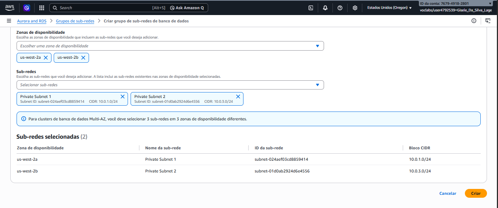

---

### 🗄️ Instância RDS Multi-AZ
- Engine: **MySQL**  
- Identificador: `db-lab`  
- Classe: `db.t3.medium`  
- Banco inicial criado: `lab1`   

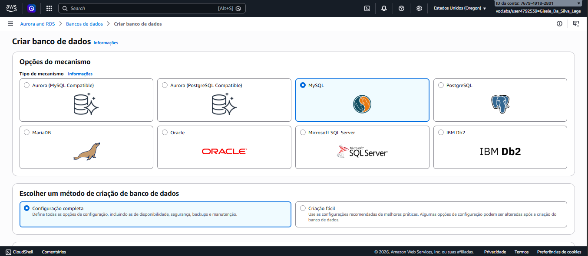
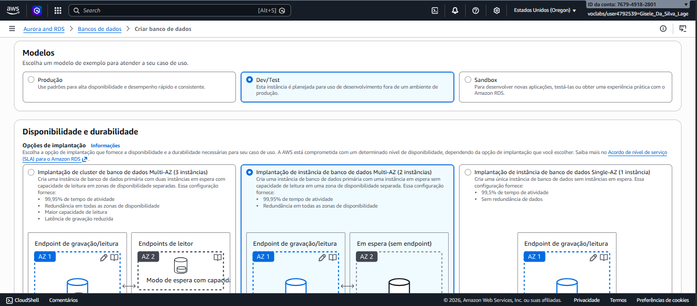
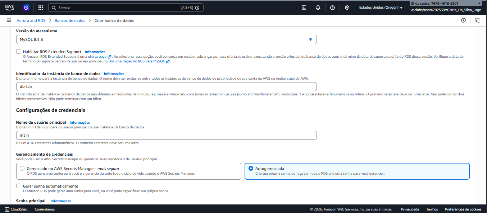
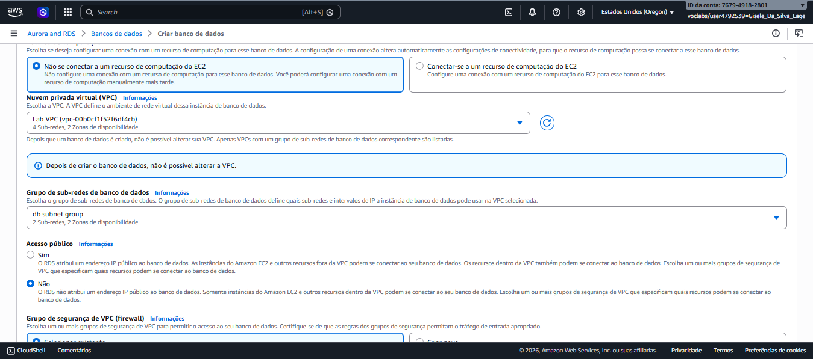
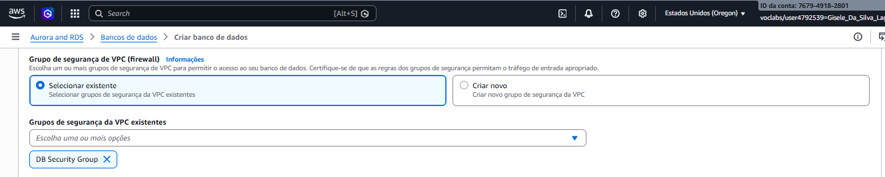
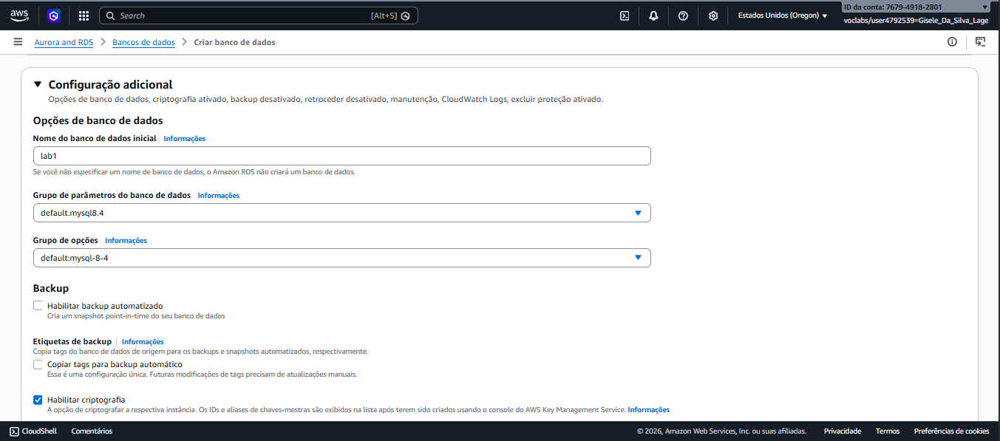

Após definir todas as configurações da instância, o console da AWS apresenta uma série de telas de confirmação.  
Essas telas registram o processo de criação do RDS e mostram o status de provisionamento até que o banco esteja disponível para uso.

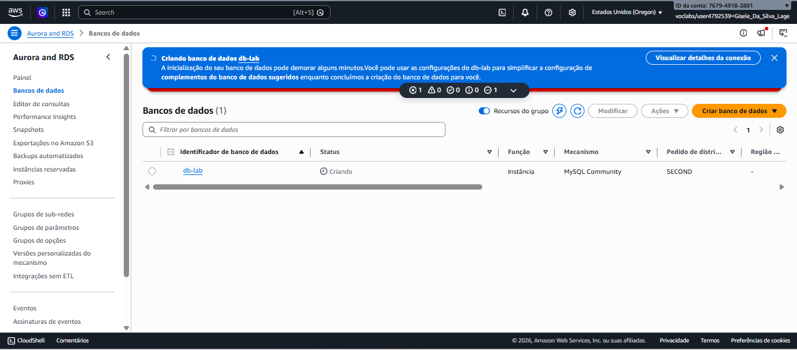
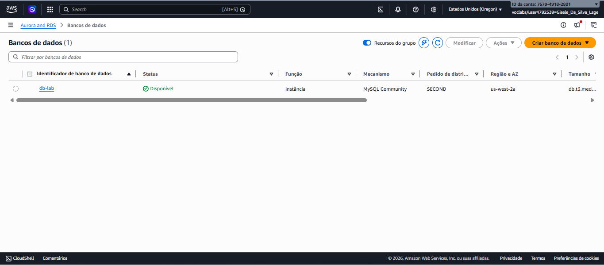

---

### 📡 Endpoint da Instância RDS
Após a criação, o console fornece o **endpoint** da instância, que é utilizado pela aplicação web ou pelo cliente MySQL para se conectar ao banco de dados.  
Esse endpoint é essencial para a integração, pois substitui o IP direto e garante acesso ao banco em alta disponibilidade.

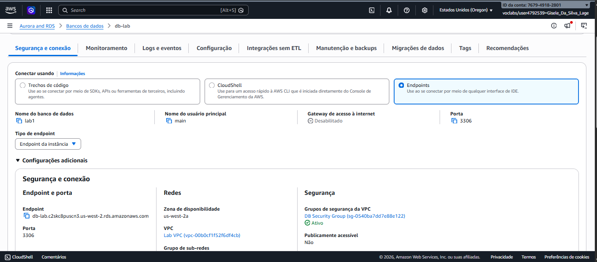

---

## 🔗 Tentativa de Conexão pela EC2

Nesta etapa, foi realizada a tentativa de conexão ao banco de dados RDS a partir da instância EC2.  
O processo envolveu acessar o servidor web, preencher os dados de conexão com o endpoint do RDS e validar a comunicação.

- Tela da instância EC2
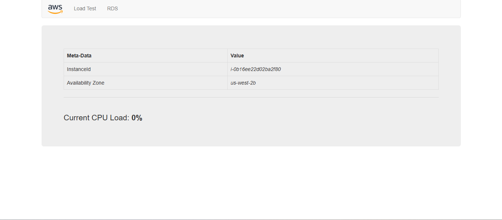

- Tela de preenchimento dos dados de conexão com o endpoint RDS:  
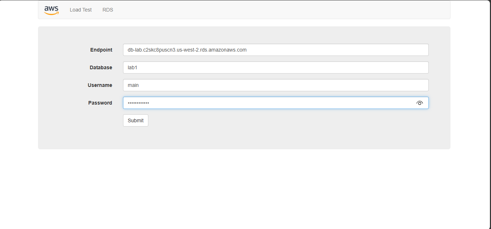

- Tela de erro de conexão  
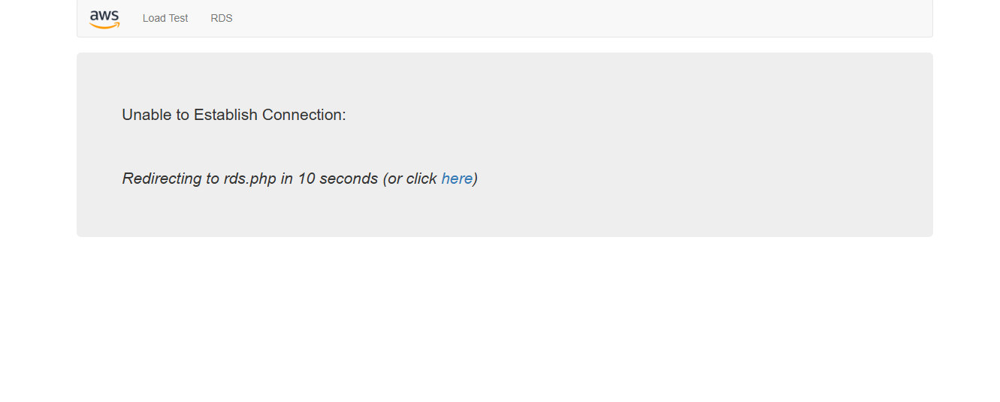

> **Erro encontrado:** a aplicação não conseguiu se conectar ao banco de dados RDS diretamente.  
> **Alternativa:** utilizei acesso via **SSH** para estabelecer a conexão, que será detalhado no próximo tópico.

---

## 📝 Conexão via SSH (Alternativa Funcional)

Como a conexão direta pelo servidor web não funcionou, foi necessário utilizar a instância EC2 acessada por **SSH** para se conectar ao RDS.  
Nos dois métodos a EC2 é utilizada:  
- No método do **lab**, a aplicação web da EC2 tenta se conectar ao RDS, mas falha.  
- No método alternativo via **SSH**, a conexão é feita manualmente de dentro da EC2 usando o cliente MySQL, e funciona corretamente.  

Passo a passo documentado:

- Conexão SSH feita  
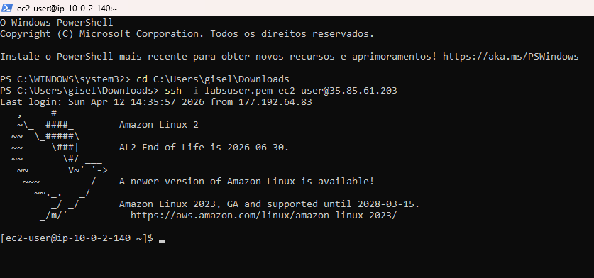

- Cliente MySQL instalado  
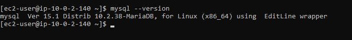

- Entrou na instância do servidor RDS  
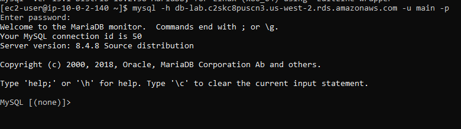

- Mostrou bancos de dados do servidor  
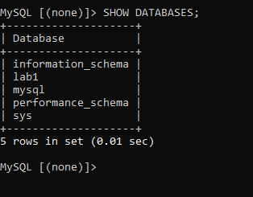

- Entrou no BD `lab1` que está vazio  
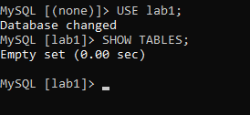

- Criou tabela nesse BD  
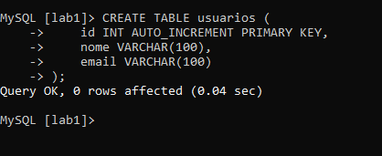

- Inseriu valores na tabela  
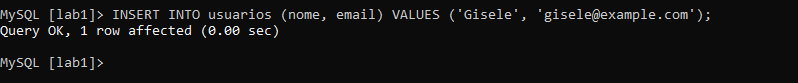

- Mostrou o registro da tabela  
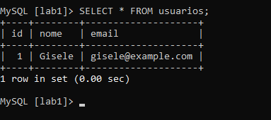

- Fechou conexão com RDS e EC2  
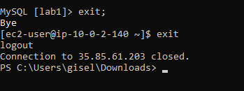

---

## 📌 Evidência do Problema no Lab
A tentativa de conexão direta pelo servidor web (preenchendo endpoint, database, usuário e senha) resultou em **erro de conexão**.  
Isso comprova que o problema está na configuração do laboratório: o RDS não aceita esse tipo de acesso direto pela aplicação web.  

Nos dois casos a EC2 é utilizada:  
- No método do **lab**, a aplicação web da EC2 tenta se conectar ao RDS, mas falha.  
- No método alternativo via **SSH**, a conexão é feita manualmente de dentro da EC2 usando o cliente MySQL, e funciona corretamente.  

---

## 📊 Validação Final

- O servidor web acessa o banco com sucesso.  
- O banco está protegido por regras de segurança (somente Web Security Group tem acesso).  
- Replicação Multi-AZ funcionando: dados disponíveis mesmo em caso de falha em uma AZ.  

---

## 📝 Conclusão

Este laboratório demonstrou a implementação prática de um banco de dados relacional altamente disponível na AWS com o Amazon RDS.  

### Principais aprendizados:
- **Segurança**: uso de Security Groups para restringir acesso.  
- **Alta disponibilidade**: configuração Multi-AZ com failover automático.  
- **Integração**: aplicação web conectada ao banco via endpoint único.  
- **Boas práticas**: banco em subnets privadas, aplicação em subnets públicas.  
- **Resolução de problemas**: erros inesperados documentados e alternativas propostas.  

✅ **Resumo final:**  
O exercício evidencia que o Amazon RDS é uma solução robusta para cargas de trabalho críticas, oferecendo **resiliência, segurança e simplicidade de gerenciamento** em ambientes de nuvem, mesmo diante de falhas inesperadas.
