# 🌐 Implementação de Rede Personalizada e Alta Disponibilidade na AWS (VPC)

---

## 💼 Cenário de Negócio

Este projeto simula a demanda de um cliente da Fortune 100 que necessita de uma infraestrutura de rede robusta, personalizada e segura na nuvem AWS. 

A solução foca na criação de uma **Virtual Private Cloud (VPC)** isolada, dividida em sub-redes públicas e privadas distribuídas em múltiplas Zonas de Disponibilidade (Multi-AZ). Essa arquitetura garante que aplicações críticas (como servidores web) fiquem protegidas por camadas de firewall e possuam conectividade controlada com a internet.

---

## 🎯 Objetivo do Projeto

Projetar e implementar uma infraestrutura de rede segmentada, configurar tabelas de rotas para tráfego público e privado e realizar o deploy de um servidor web (EC2) funcional para validar a conectividade e a segurança da rede.

---

## 🏗️ Arquitetura da Solução

O projeto segue o modelo de arquitetura padrão de mercado para alta disponibilidade:

- **VPC:** Rede isolada com bloco CIDR `10.0.0.0/16`.
- **Sub-redes:** Divisão entre camadas Públicas (acesso externo) e Privadas (isoladas).
- **Gateways:** Utilização de **Internet Gateway** para entrada/saída de dados e **NAT Gateway** para saída segura de recursos privados.
- **Segurança:** Implementação de **Security Groups** atuando como firewall estatal.

---

## 🛠️ Tecnologias Utilizadas

- **AWS VPC** (Virtual Private Cloud)
- **Amazon EC2** (Elastic Compute Cloud)
- **Subnets** (Públicas e Privadas)
- **Route Tables** (Tabelas de Rotas)
- **Internet Gateway & NAT Gateway**
- **Security Groups** (Firewall de rede)

---

## ⚙️ Implementação Prática

### 1. Criação da VPC e Infraestrutura Base

A primeira etapa consistiu no provisionamento da VPC utilizando o assistente, garantindo a criação automatizada dos componentes de conectividade inicial e a definição dos blocos de IP.

#### 🔧 Configuração Inicial da VPC
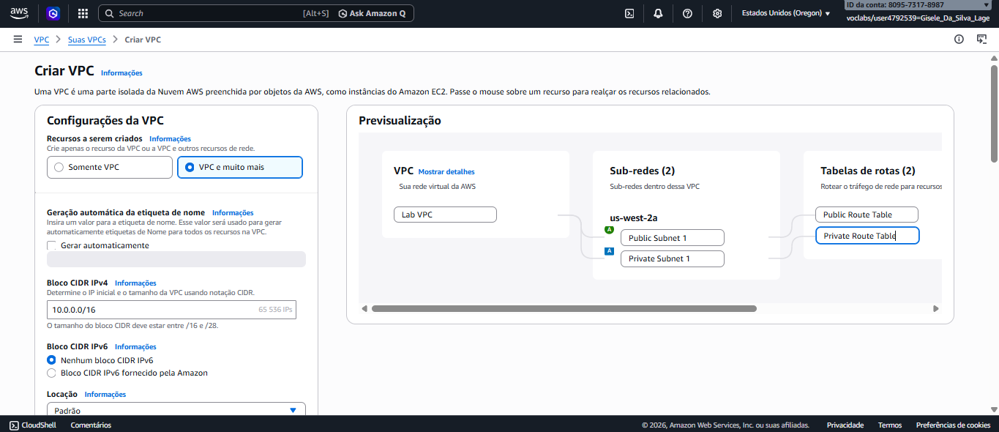
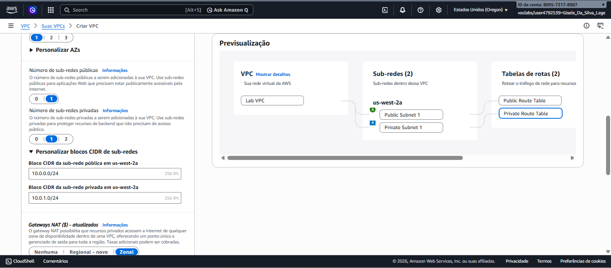

#### 📋 Detalhes da VPC Criada
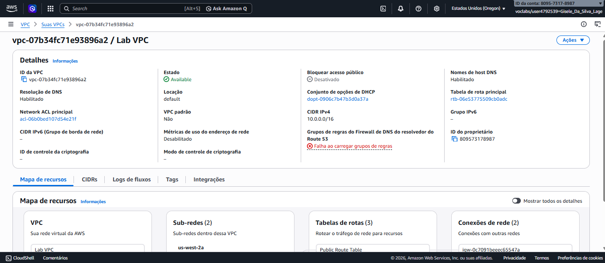

- **Nome:** `Lab VPC`
- **CIDR:** `10.0.0.0/16`
- **Componentes:** 1 Sub-rede Pública, 1 Sub-rede Privada e 1 NAT Gateway inicial.

---

### 2. Expansão para Alta Disponibilidade (Multi-AZ)

Para atender aos requisitos de resiliência e alta disponibilidade, foram criadas sub-redes adicionais manualmente numa segunda Zona de Disponibilidade.

#### 🛠️ Processo de Criação de Sub-redes
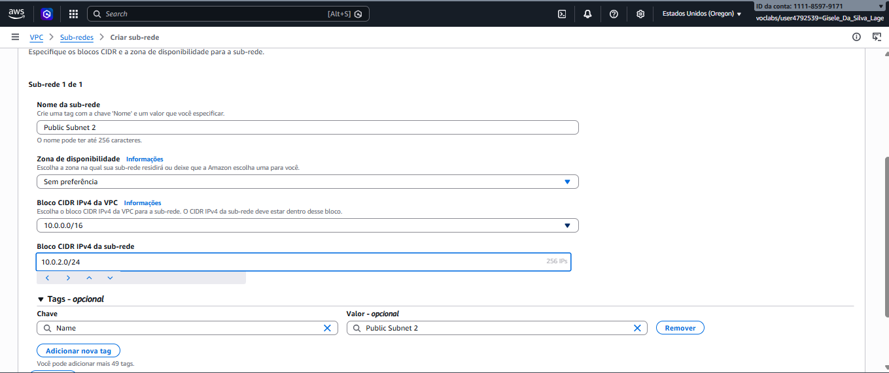
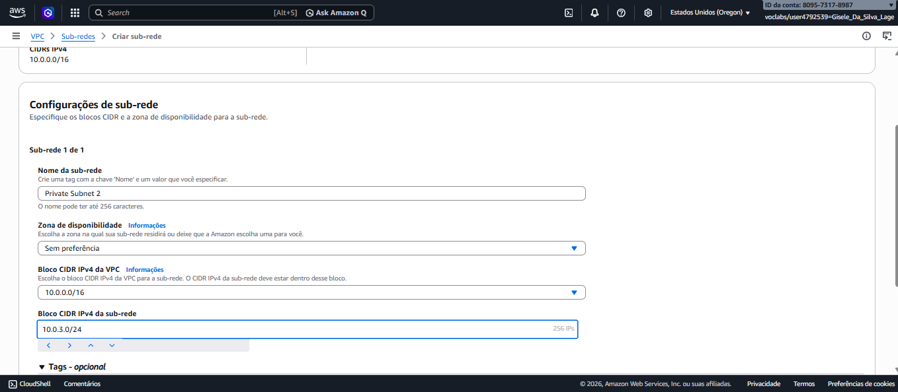

#### ✅ Lista Final de Sub-redes
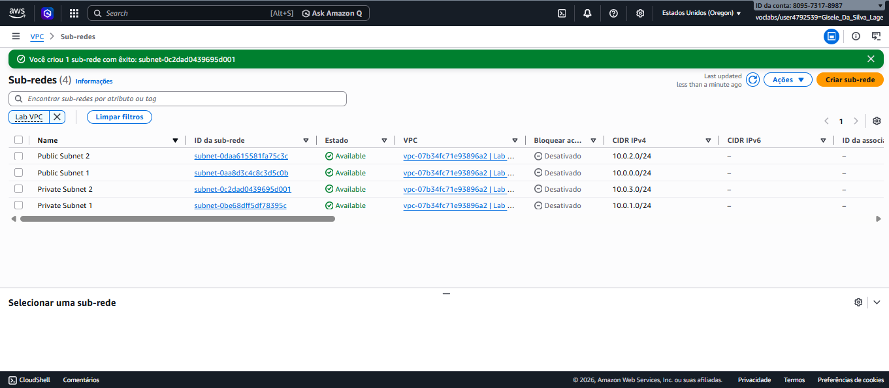

---

### 3. Configuração de Roteamento e Associações

Nesta fase, as sub-redes foram organizadas dentro das tabelas de rotas para garantir que o tráfego público e privado seguisse os caminhos corretos (Internet Gateway vs NAT Gateway).

#### 🛣️ Tabelas de Rotas Identificadas
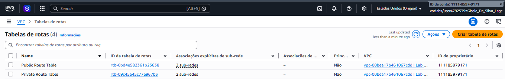

#### 🔗 Associações Explícitas
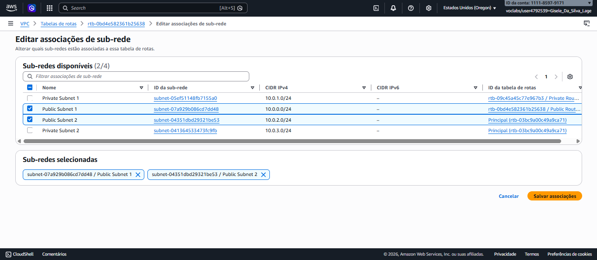
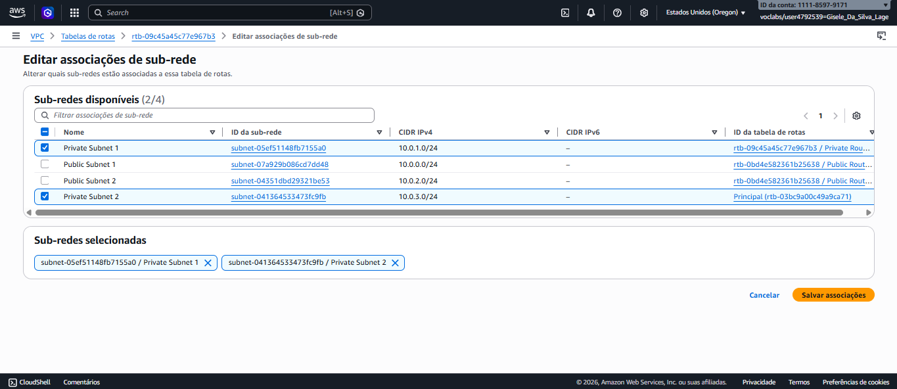

---

### 4. Configuração do Web Security Group (Firewall)

Foi criado um grupo de segurança específico para a instância EC2, atuando como um firewall virtual para controlar o tráfego de entrada.

#### 🛡️ Criação do Grupo de Segurança
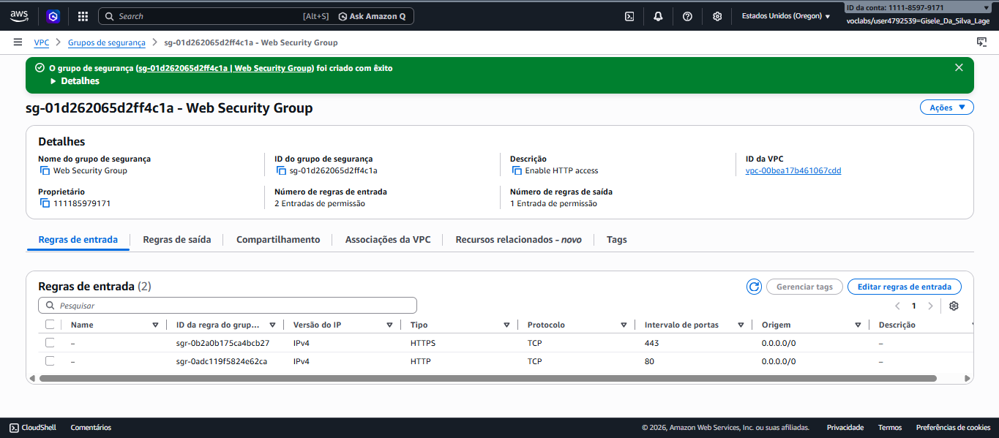

- **Regra de Entrada:** Porta `80` (HTTP) liberada para `0.0.0.0/0`.
- **Objetivo:** Permitir apenas tráfego web legítimo para o servidor.

---

### 5. Deployment e Validação Final

Para validar toda a infraestrutura de rede, foi lançada uma instância EC2 na sub-rede pública com um script de automação para o servidor web.

#### 🚀 Instância Provisionada
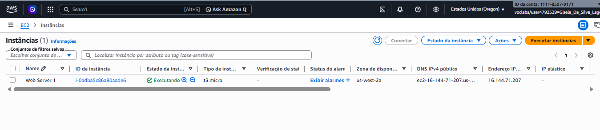

#### 🌐 Resultado: Acesso Externo Confirmado
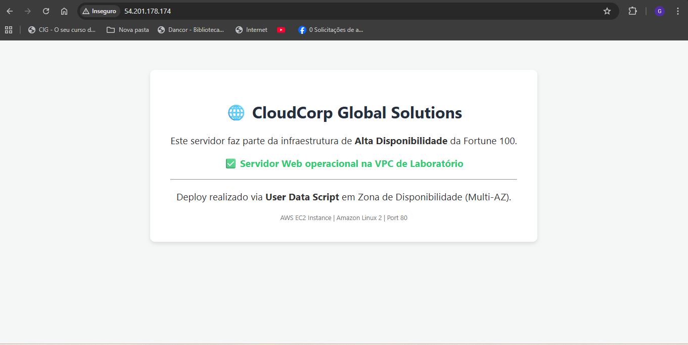

O sucesso no carregamento da página personalizada da **CloudCorp Global Solutions** confirma que a VPC está configurada corretamente, com rotas externas funcionais e segurança de rede aplicada.

---

## 📝 Conclusão

Este laboratório permitiu aplicar conceitos fundamentais de arquitetura de rede em nuvem, garantindo a segregação de tráfego e a alta disponibilidade através de múltiplas zonas de disponibilidade.

### Principais aprendizados:

- **Isolamento de Recursos:** A importância de manter bases de dados e recursos sensíveis em sub-redes privadas.
- **Roteamento:** Como controlar o fluxo de saída e entrada de tráfego via Internet Gateways.
- **Automação (User Data):** O poder de configurar serviços automaticamente durante o provisionamento da infraestrutura.

✅ **Resumo final:** A infraestrutura implementada reflete as melhores práticas de mercado para ambientes corporativos seguros, escaláveis e resilientes na AWS.
